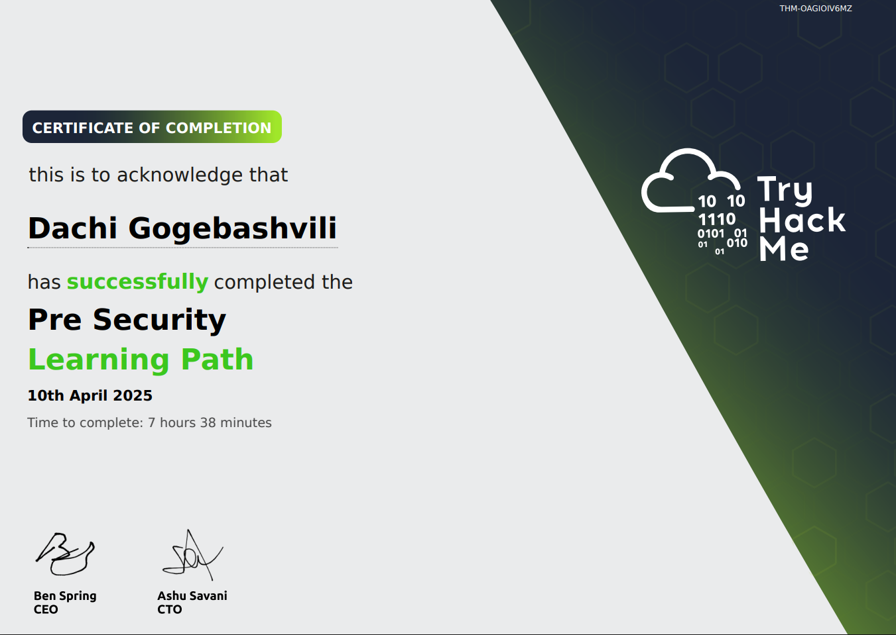
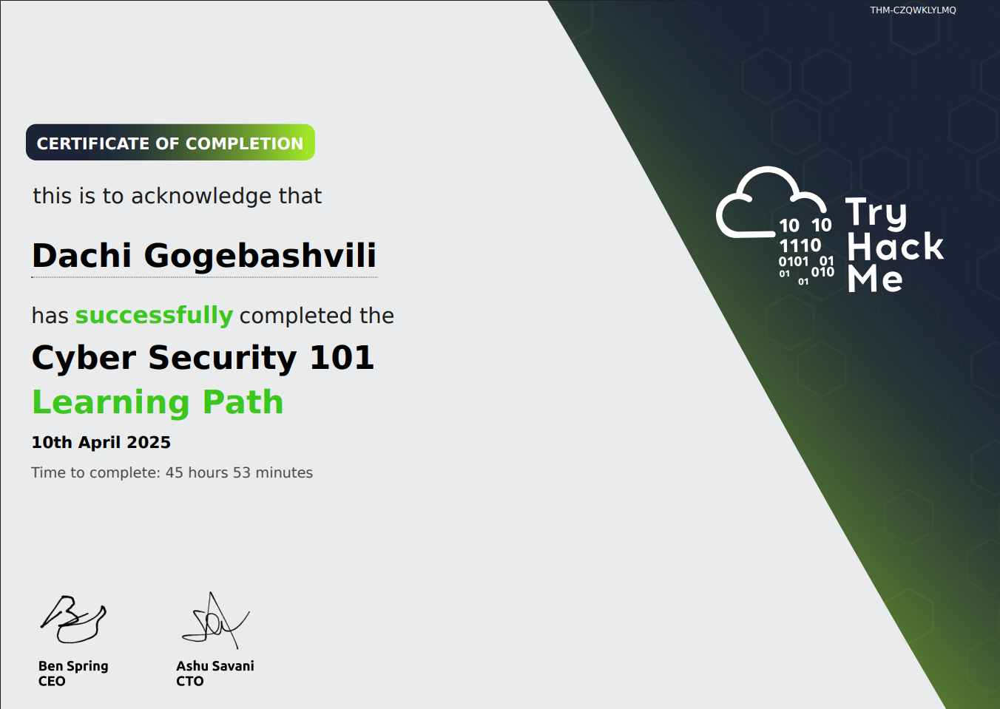

# SOC Analyst Portfolio 🛡️

Welcome to my SOC Analyst portfolio! This repo documents my hands-on learning and investigations from TryHackMe, home lab exercises, and blue team tooling as I work toward a career in cybersecurity.

---

## 🔍 Current Learning Path

🎓 **TryHackMe: SOC Level 1**

- [x] Security 101
- [x] Windows Event Logs
- [x] Phishing Analysis
- [x] SIEM (Splunk, Snort, WireShark, Splunk)
- [x] Threat Intelligence & Triage (Yara, openCTI, MISP)

🎓 **Udemy: The Complete Hands-On Cybersecurity Analyst Course**

- [x] Ultimate Cyber Security Primer
- [x] Password Cracking
- [x] Email and Phishing Analysis
- [x] SIEMs
- [x] Threat Hunting
- [ ] Vulnerability Scanning

🎓 **Udemy: Complete Ethical Hacking Bootcamp**

- [x] Scanning (Nmap)
- [x] Gaining Access
- [x] MITM 
---

## 📂 Portfolio Sections

### 🧪 THM Labs & Writeups
**Hands-on investigations with explanations of how I identified and responded to threats:**
- `THM-SOC-Level1/Cyber-Defence-Frameworks.md`
- `THM-SOC-Level1/Intro to Cyber Threat Intel.md`
- `THM-SOC-Level1/Threat Intelligence Tools.md`
- `THM-SOC-Level1/Yara.md`
- `THM-SOC-Level1/OpenCTI.md`
- `THM-SOC-Level1/MISP.md`
### 🧪 Udemy SOC 1 Writeups
- `Udemy-Cybersecurity-Analyst-Course/Email-and-Phishing-Analisys.md`
- `Udemy-Cybersecurity-Analyst-Course/Password-Cracking.md`
### 🧪 Udemy Ethical Hacking Writeups
- `Udemy-Ethical-Hacking-Bootcamp/Lunux-Operating-System.md`
- `Udemy-Ethical-Hacking-Bootcamp/Scanning.md`
- `Udemy-Ethical-Hacking-Bootcamp/Vulnerability-Scanning-and-Exploitation.md`

---
## 📜 Certifications
- 
- 
- 🎓 CompTIA Security+ *(Planning)*
---

### 🛠️ Tool Using
| Project | Description | Tools |
|--------|-------------|-------|
| **SOC Homelab** | Built a virtual SOC using Wazuh and ELK Stack to monitor and analyze logs. | Wazuh, ELK, VirtualBox |
| **TryHackMe Labs** | Hands-on rooms focusing on blue team, threat hunting, and log analysis. | Wireshark, Splunk, Suricata |
| **Log Analysis Practice** | Simulated incidents using Windows event logs and security alerts. | Event Viewer, Sysmon, Sigma Rules |

---

### 🛡️ Cybersecurity Cheat Sheet
- [Cybersecurity Cheat Sheet](cheetsheets/Cybersecurity-Cheat-Sheet.md)

---

### 📝 Simulated Incident Reports
Realistic practice scenarios to simulate alert triage and investigation workflow.

---

## 🔗 Connect with Me
- 🌐 https://www.linkedin.com/in/dachigog/
- 📫 Email: h3xvault@proton.me

Thanks for checking it out!
