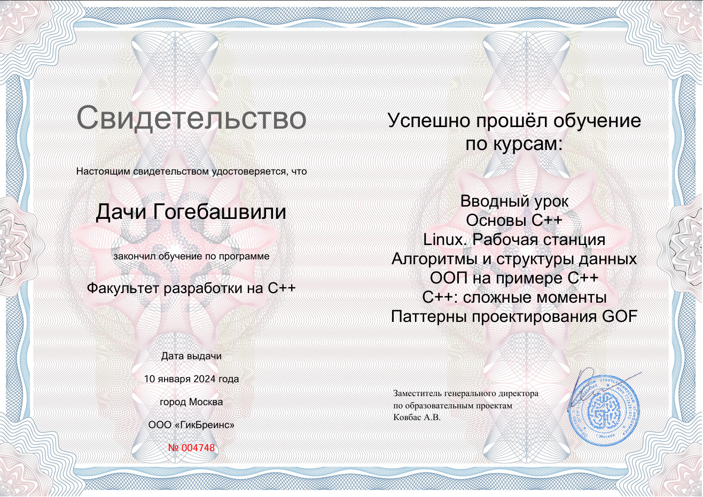

# SOC Analyst Portfolio 🛡️

Welcome to my SOC Analyst portfolio! This repo documents my hands-on learning and investigations from TryHackMe, home lab exercises, and blue team tooling as I work toward a career in cybersecurity.

---

## 🔍 Current Learning Path

🎓 **TryHackMe: SOC Level 1**

- [x] Security 101
- [x] Windows Event Logs
- [x] Phishing Analysis
- [x] SIEM (Splunk, Snort, WireShark, Splunk)
- [x] Threat Intelligence & Triage (Yara, openCTI, MISP)

🎓 **Udemy: The Complete Hands-On Cybersecurity Analyst Course**

- [x] Ultimate Cyber Security Primer
- [x] Password Cracking
- [x] Email and Phishing Analysis
- [x] SIEMs
- [x] Threat Hunting
- [x] Vulnerability Scanning

🎓 **Udemy: Complete Ethical Hacking Bootcamp**

- [x] Scanning (Nmap)
- [x] Gaining Access
- [x] MITM 
---

## 📂 Portfolio Sections

### 🧪 THM Labs & Writeups
**Hands-on investigations with explanations of how I identified and responded to threats:**
- `THM-SOC-Level1/Cyber-Defence-Frameworks.md`
- `THM-SOC-Level1/Network Security and Traffic Analysis`
- `THM-SOC-Level1/Cyber Threat Intelligence`
- `THM-SOC-Level1/Challanges`
### 🧪 Udemy SOC 1 Writeups
- `Udemy-Cybersecurity-Analyst-Course/Email-and-Phishing-Analisys.md`
- `Udemy-Cybersecurity-Analyst-Course/Password-Cracking.md`
### 🧪 Udemy Ethical Hacking Writeups
- `Udemy-Ethical-Hacking-Bootcamp/Lunux-Operating-System.md`
- `Udemy-Ethical-Hacking-Bootcamp/Scanning.md`
- `Udemy-Ethical-Hacking-Bootcamp/Vulnerability-Scanning-and-Exploitation.md`

---

## 🛠️ Skills in Progress

- Security Information & Event Management (SIEM)
- Log Analysis (Windows, Linux)
- MITRE ATT&CK Framework
- Basic Incident Response
- Network Fundamentals (TCP/IP, DNS, HTTP)
- Tools: Splunk, Wazuh, Wireshark, Nmap, Suricata

---

## 📜 Certifications
- 
- [Certificate Link](https://tryhackme-certificates.s3-eu-west-1.amazonaws.com/THM-OAGIOIV6MZ.pdf)
- 
- [Certificate Link](https://tryhackme-certificates.s3-eu-west-1.amazonaws.com/THM-CZQWKLYLMQ.pdf)
- 
- 🎓 CompTIA Security+ *(Planning)*
  
---

### 🛡️ Cybersecurity Cheat Sheet
- [Cybersecurity Cheat Sheet](cheetsheets/Cybersecurity-Cheat-Sheet.md)

---

### 📝 Simulated Incident Reports
Realistic practice scenarios to simulate alert triage and investigation workflow.

---

## 🔗 Connect with Me
- 🌐 https://www.linkedin.com/in/dachigog/
- 📫 Email: h3xvault@proton.me

Thanks for checking it out!
