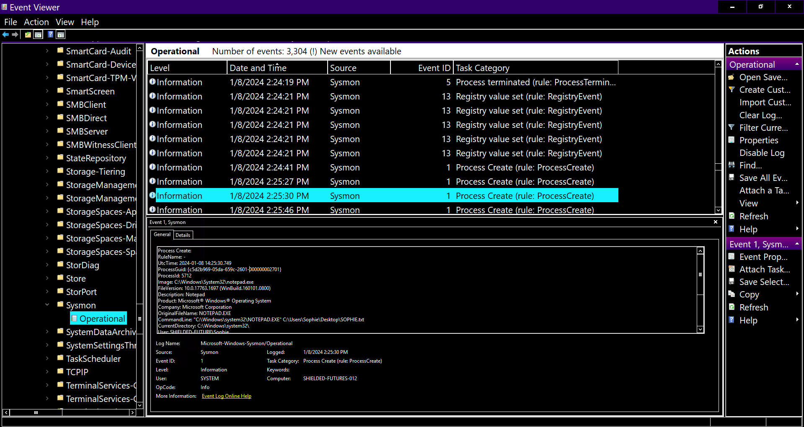
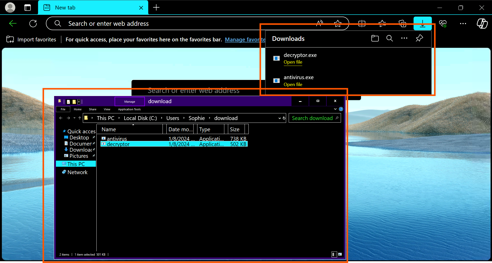
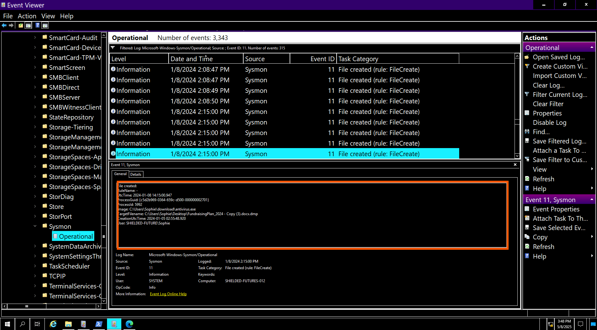
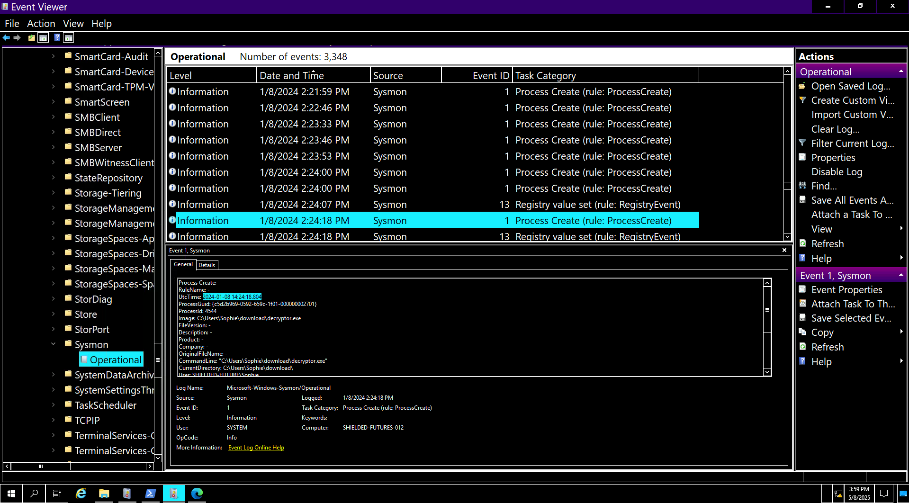

# 🛡️ Retracted - Challange
---

## 🛠️ Tools Used
  - TryHackMe interactive lab environment
  - Windows Event Viewer
---
## 🔍 Scenario 1 Task 

"Thanks for coming. I know you are busy with your new job, but I did not know who else to turn to."
"So I downloaded and ran an installer for an antivirus program I needed. After a while, I noticed I could no longer open any of my files. And then I saw that my wallpaper was different and contained a terrifying message telling me to pay if I wanted to get my files back. I panicked and got out of the room to call you. But when I came back, everything was back to normal."
"Except for one message telling me to check my Bitcoin wallet. But I don't even know what a Bitcoin is!"
"Can you help me check if my computer is now fine?"

---
## ✅ Status: Completed
