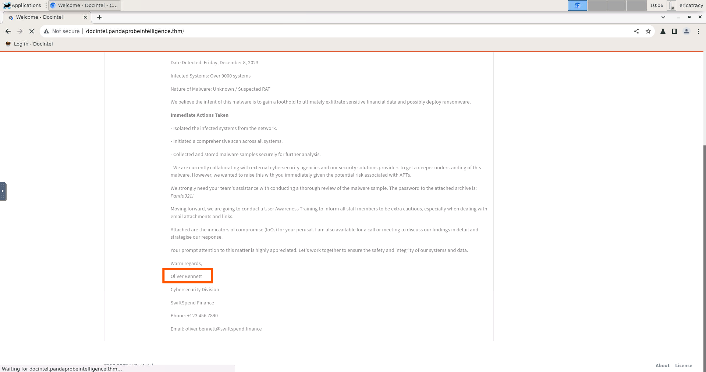
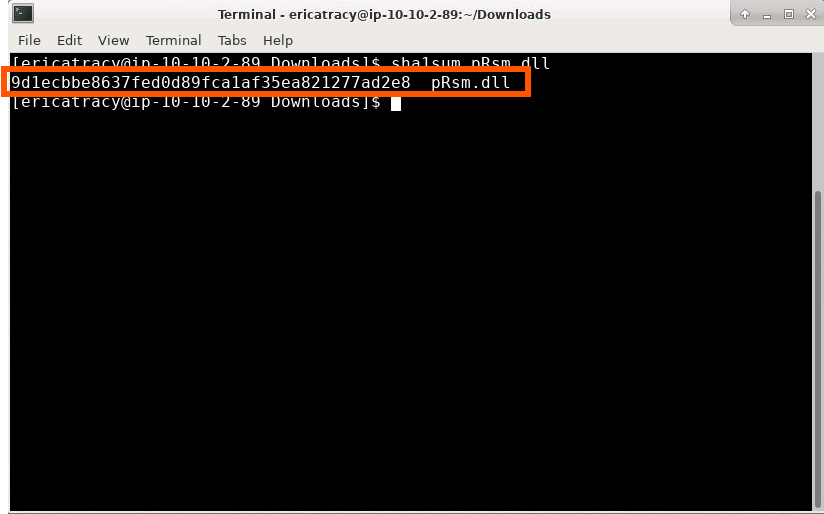
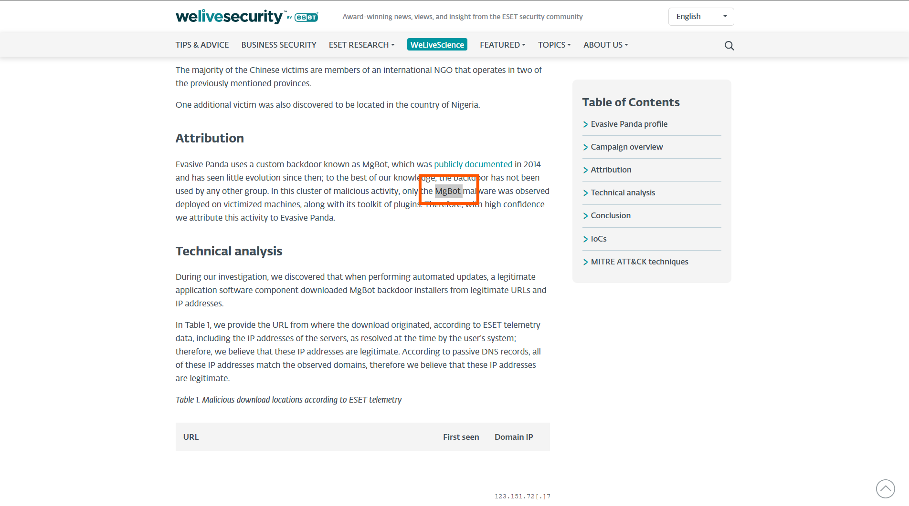
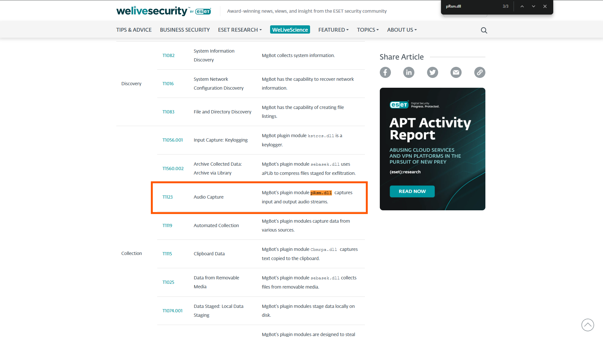
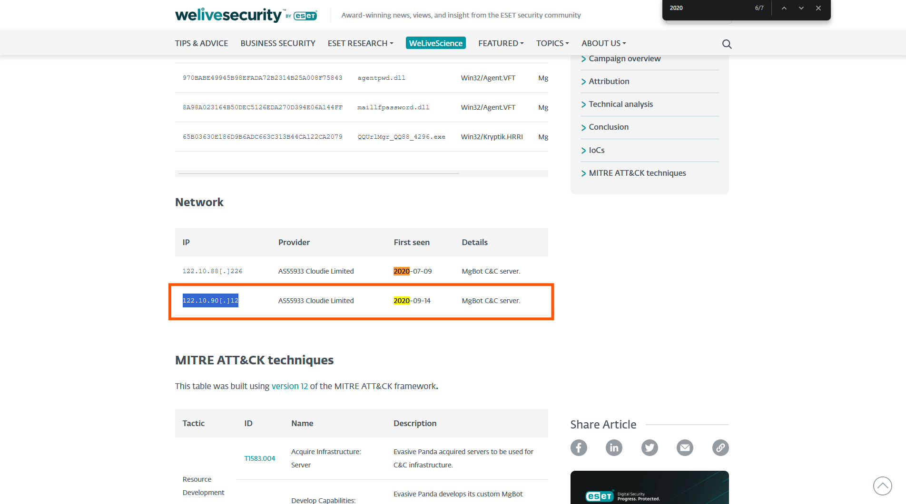
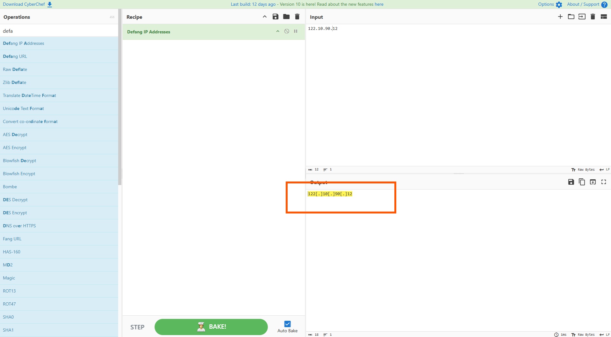
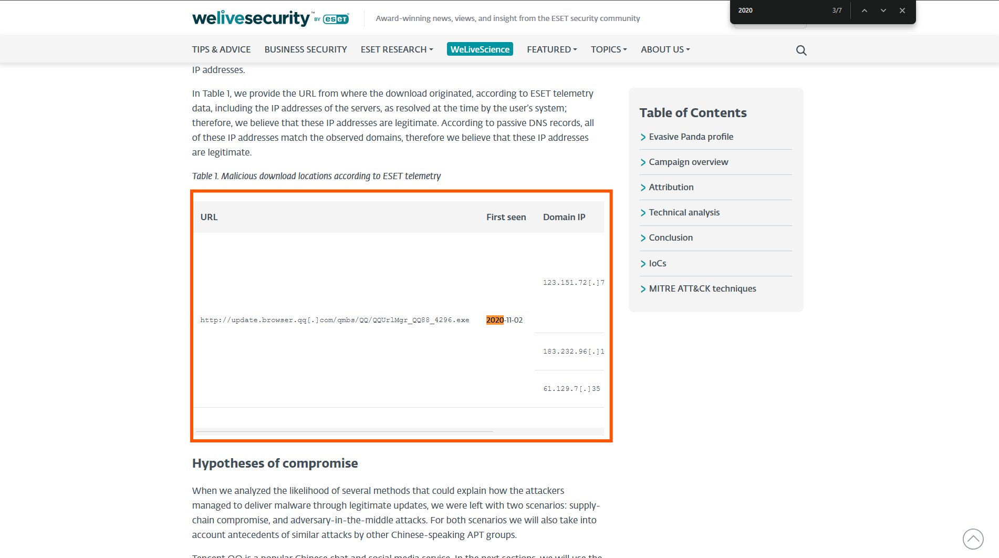
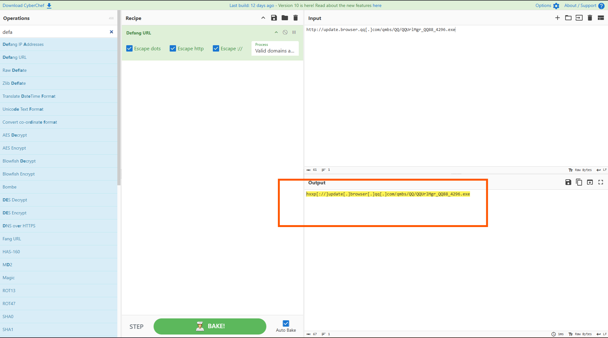

# 🛡️ Friday Overtime - Challange
---

## 🛠️ Tools Used
  - TryHackMe interactive lab environment
  - MITRE ATT&CK
  - Google
---
## 🔍 Scenario 1 Task 

It's a Friday evening at PandaProbe Intelligence when a notification appears on your CTI platform. While most are already looking forward to the weekend, you realise you must pull overtime because SwiftSpend Finance has opened a new ticket, raising concerns about potential malware threats. The finance company, known for its meticulous security measures, stumbled upon something suspicious and wanted immediate expert analysis.

As the only remaining CTI Analyst on shift at PandaProbe Intelligence, you quickly took charge of the situation, realising the gravity of a potential breach at a financial institution. The ticket contained multiple file attachments, presumed to be malware samples.

With a deep breath, a focused mind, and the longing desire to go home, you began the process of:

- Downloading the malware samples provided in the ticket, ensuring they were contained in a secure environment.
- Running the samples through preliminary automated malware analysis tools to get a quick overview.
- Deep diving into a manual analysis, understanding the malware's behaviour, and identifying its communication patterns.
- Correlating findings with global threat intelligence databases to identify known signatures or behaviours.
- Compiling a comprehensive report with mitigation and recovery steps, ensuring SwiftSpend Finance could swiftly address potential threats.

- Who shared the malware samples?
- 
- What is the SHA1 hash of the file "pRsm.dll" inside samples.zip?
- 
- Which malware framework utilizes these DLLs as add-on modules?
- 
- Which MITRE ATT&CK Technique is linked to using pRsm.dll in this malware framework?
- 
- What is the CyberChef defanged IP address of the C&C server first detected on 2020-09-14 using these modules?
- 
- 
- What is the CyberChef defanged URL of the malicious download location first seen on 2020-11-02?
- 
- 

---
## ✅ Status: Completed

