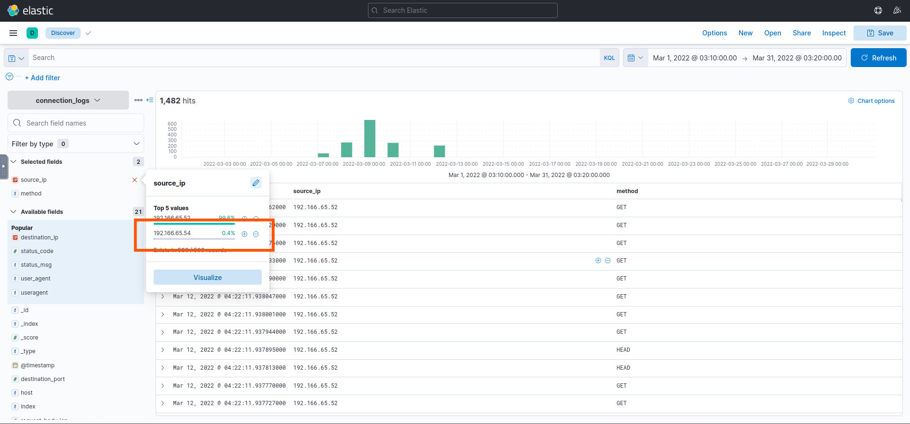
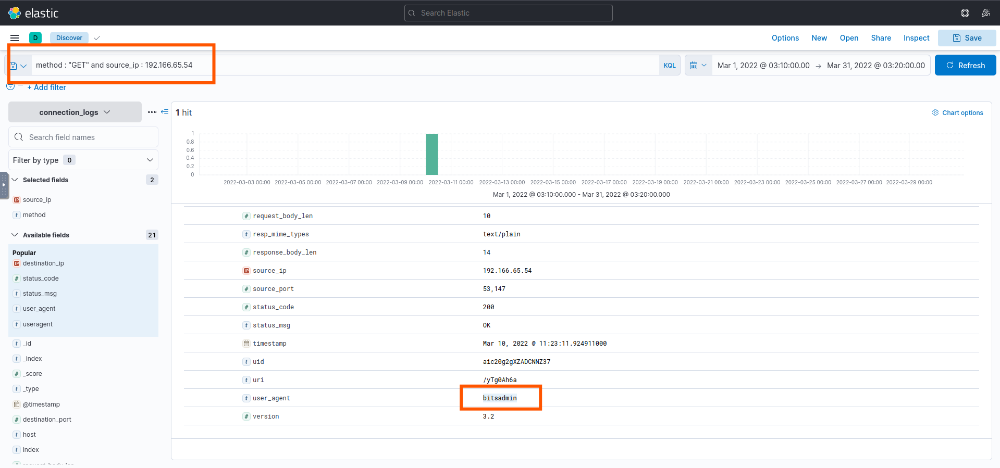
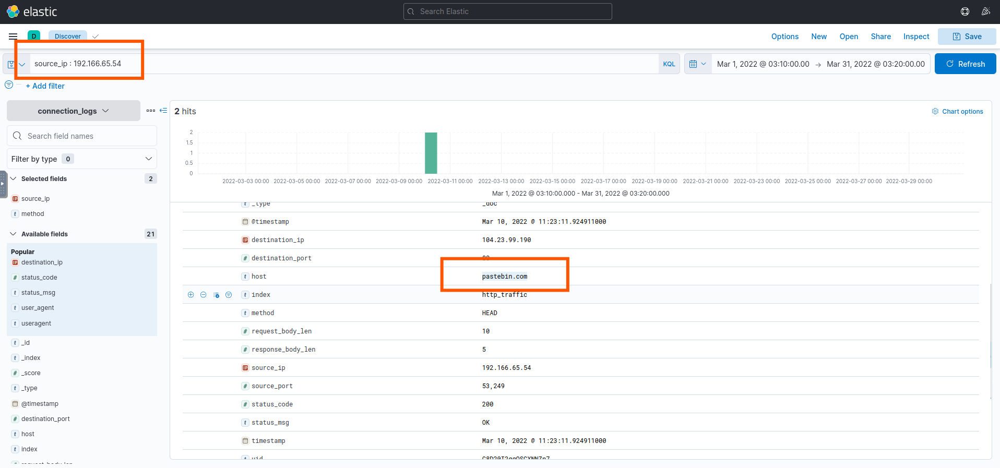
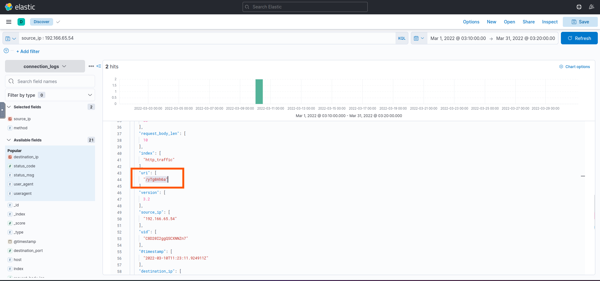
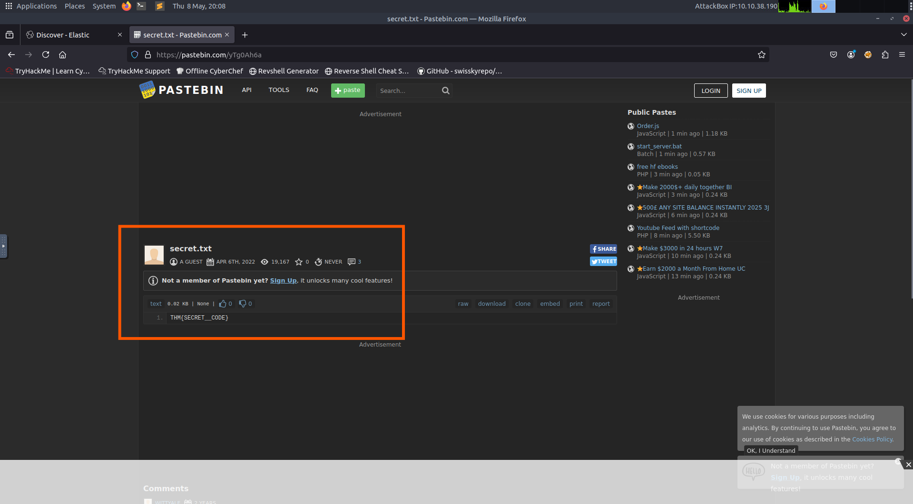
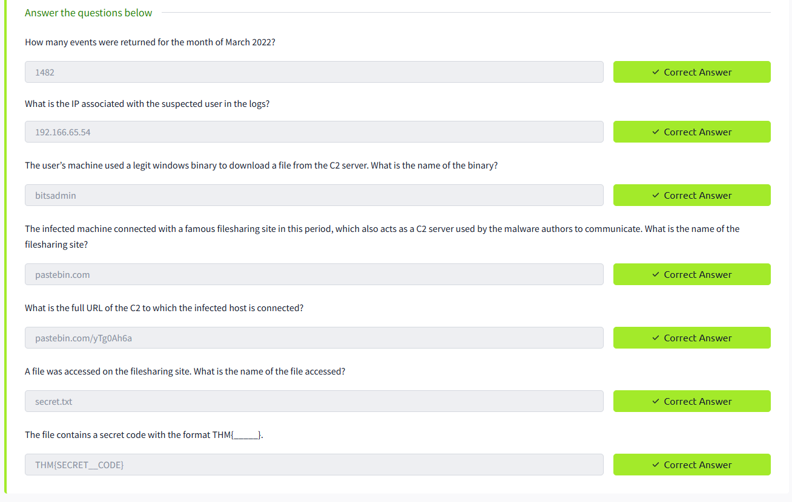

# 🛡️ ItsyBitsy - Challange
---

## 🛠️ Tools Used
  - TryHackMe interactive lab environment
  - Kibana
  - Linux
---
## 🔍 Scenario 1 Task 

During normal SOC monitoring, Analyst John observed an alert on an IDS solution indicating a potential C2 communication from a user Browne from the HR department. A suspicious file was accessed containing a malicious pattern THM:{ ________ }. A week-long HTTP connection logs have been pulled to investigate. Due to limited resources, only the connection logs could be pulled out and are ingested into the connection_logs index in Kibana.
Our task in this room will be to examine the network connection logs of this user, find the link and the content of the file, and answer the questions.

---
## ✅ Status: Completed
