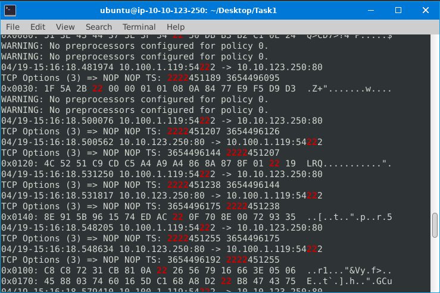

# 🐷 🐽 Snort - The Basics - Challange
---

## 🛠️ Tools Used
  - TryHackMe interactive lab environment
  - Snort
  - Linux
---

## 🔍 Scenario 1 | Brute-Force

  J&Y Enterprise is one of the top coffee retails in the world. They are known as tech-coffee shops and serve millions of coffee lover tech geeks and IT specialists every day. 
  The super-secret of this recipe is hidden in a digital safe. Attackers are after this recipe, and J&Y enterprises are having difficulties protecting their digital assets.
  AI assistant detected a Brute Force attack.

  Objective: You need to observe the traffic with Snort and identify the anomaly first. Then you can create a rule to stop the brute-force attack

 - start to run Snort in sniffer mode. We will use the command `sudo snort -v -l .`, we use the `-l` to log and the . to log it in our current directory.
 - use the command `sudo snort -r snort.log.xxxxxxxx -X` to analyze the log file
 - After analizing Log file Port 22 was comming up very often
 - 
 - Used Grep to fund port 22 SSH logs`sudo snort -r snort.log.1672414629 -X | grep "ssh"`
 - 
 - Used the command `sudo snort -r snort.log.1672414629 -X -n 30`, this will only output the first 30 packets to the terminal.
 - 
 - This gave me enough information to make the rule `sudo gedit /etc/snort/rules/local.rules`
 - 
 - `drop tcp any 22 <> any any (msg:"SSH Connection attempted"; sid:100001; rev:1;)`
 - Now its time to run the command `sudo snort -c /ect/snort/snort.conf -q -Q --daq afpacket -i eth0:eth1 -A full`

## 🔍 Scenario 2 | Reverse-Shell

---
## ✅ Status: Completed

