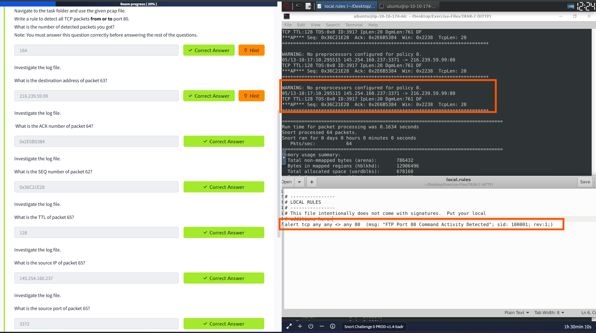
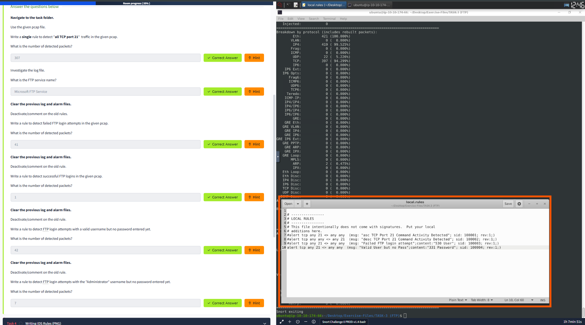
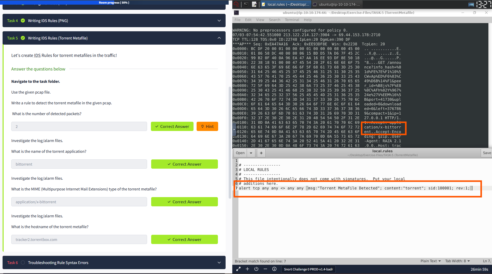

# 🐷 🐽 Snort - The Basics - Challange
---

## 🛠️ Tools Used
  - TryHackMe interactive lab environment
  - Snort
  - Linux
---
## 🔍 Scenario 1 Task - Writing IDS Rules (HTTP)
Investigate the log file.
- 

## 🔍 Scenario 2 Task - create IDS Rules for FTP traffic!
Investigate the log file.
- 

## 🔍 Scenario 2 Task - Writing IDS Rules (Torrent Metafile)!
Investigate the log file.
- 
---
## ✅ Status: Completed

