## Scenario   

A Big corporate organization Wayne Enterprises  has recently faced a cyber-attack where the attackers broke into their network, found their way to their web server, and have successfully defaced their website http://www.imreallynotbatman.com . Their website is now showing the trademark of the attackers with the message YOUR SITE HAS BEEN DEFACED  as shown below.  

  

They have requested " US " to join them as a Security Analyst and help them investigate this cyber attack and find the root cause and all the attackers' activities within their network.

The good thing is, that they have Splunk already in place, so we have got all the event logs related to the attacker's activities captured. We need to explore the records and find how the attack got into their network and what actions they performed.

This Investigation comes under the  Detection and Analysis phase.
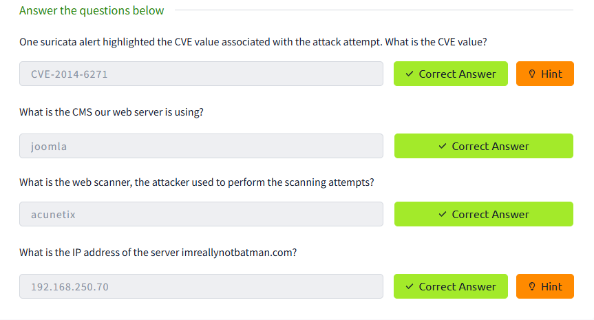
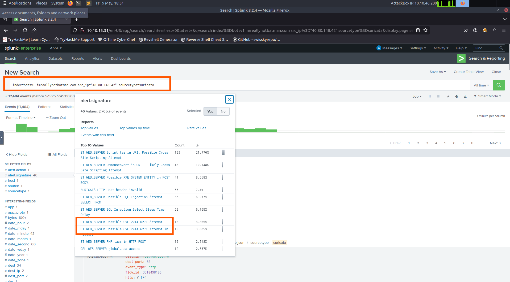
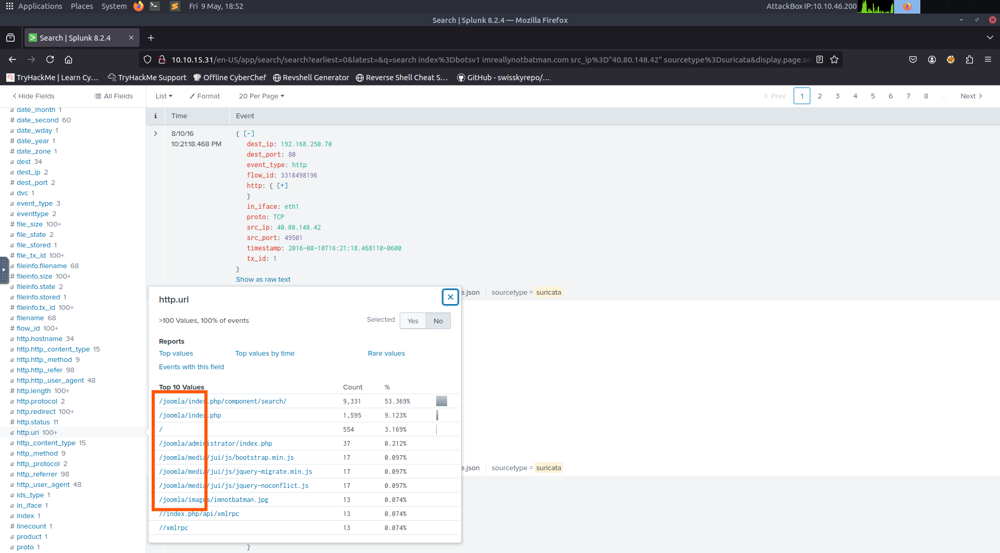
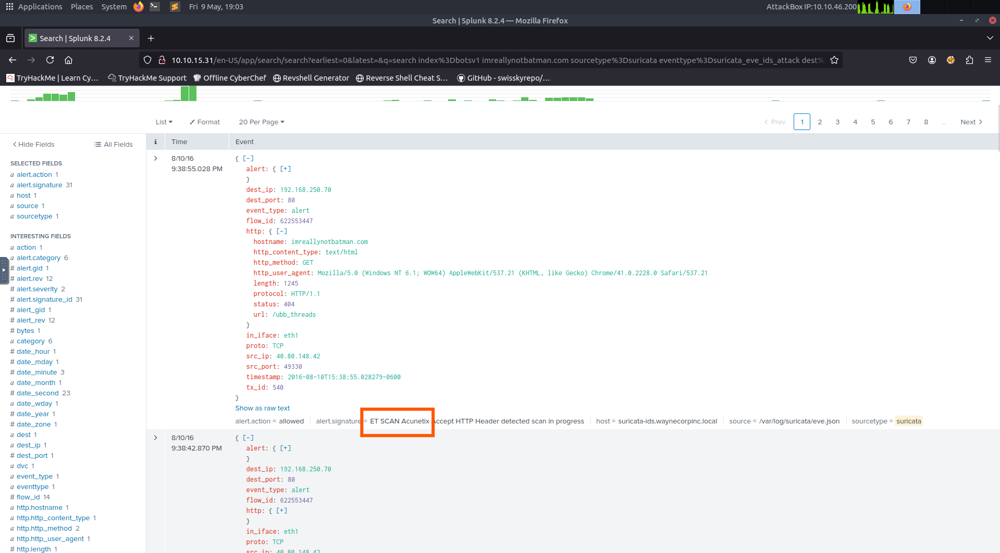
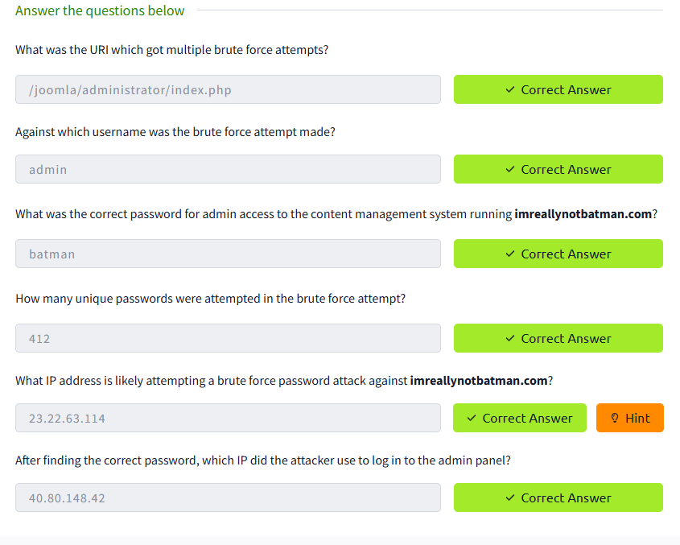
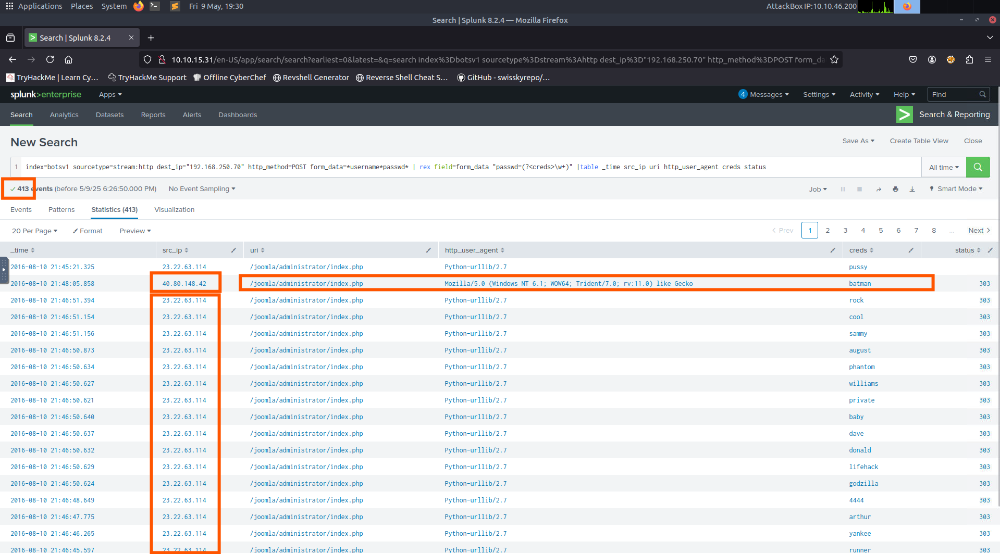
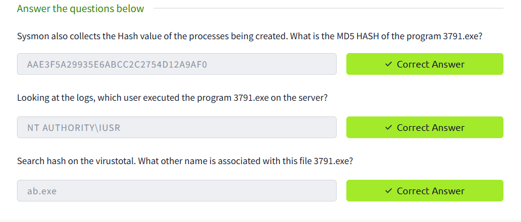
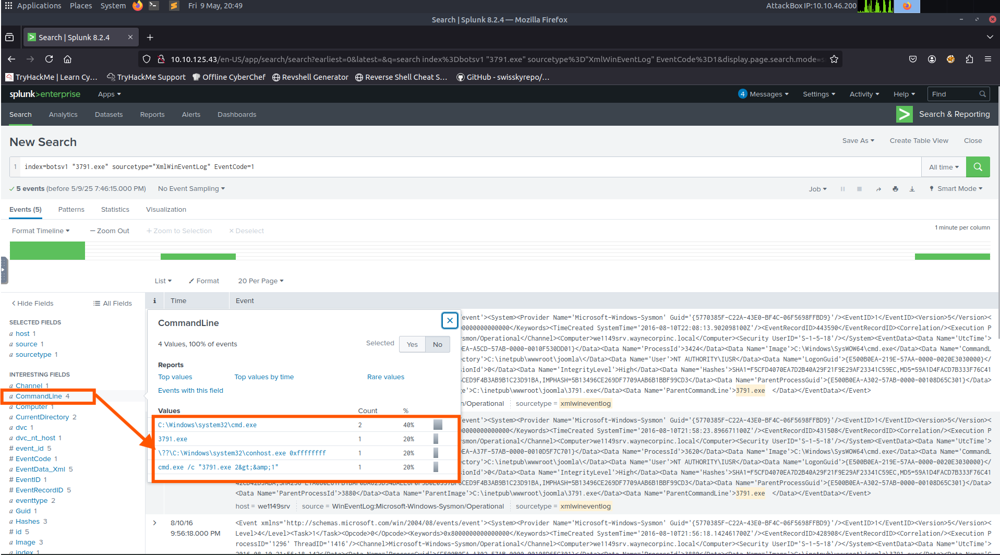
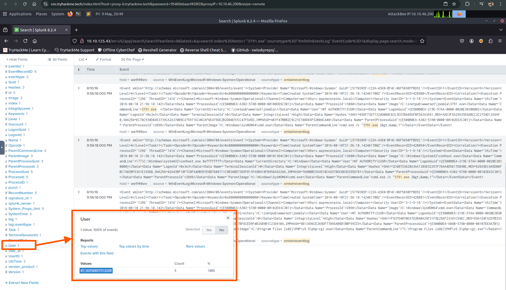
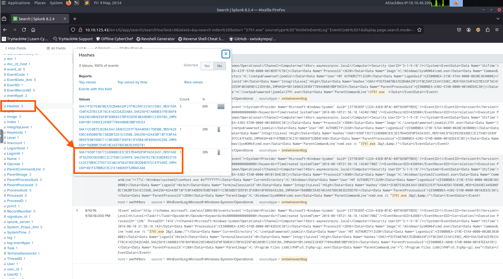
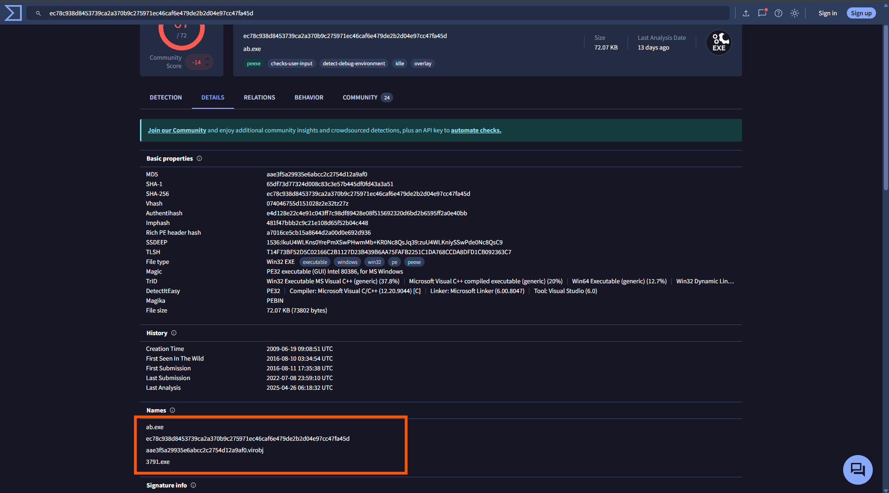
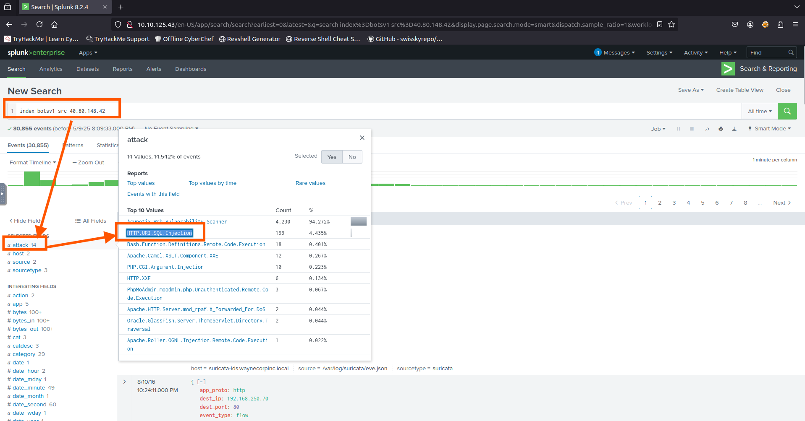
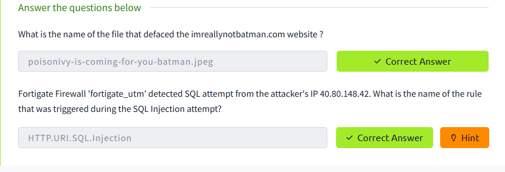
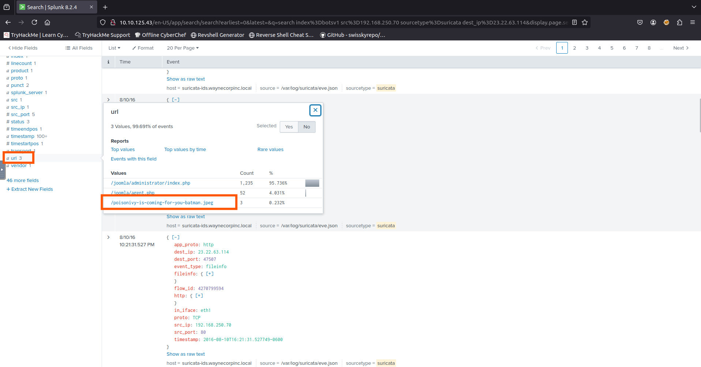
