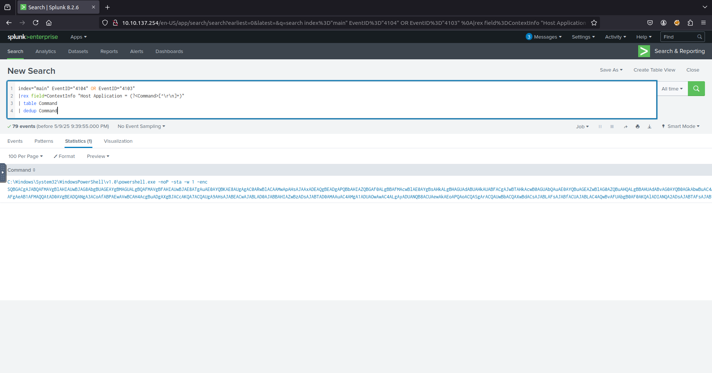

1 . On one of the infected hosts, the adversary was successful in creating a backdoor user. What is the new username?
  - First I filtered by ID number and then searched for the account hame qith query `index="main" EventID="4720"`
  - 
2 . On the same host, a registry key was also updated regarding the new backdoor user. What is the full path of that registry key?
  - Filtered by found Name and Event ID 13 `index="main" EventID=13 A1berto"`
  - 
3 . What is the command used to add a backdoor user from a remote computer?
  - Look a lot like Alberto
  - 
4 . What is the command used to add a backdoor user from a remote computer?
  - added the commandline field to see what commands where used and saw A1berto adding a backdoor
  - 
5 . How many times was the login attempt from the backdoor user observed during the investigation?
  - Could not find any attempts
  - 
6 . What is the name of the infected host on which suspicious Powershell commands were executed?
 - After adding the command to the filter this was the result
 - 
7 . PowerShell logging is enabled on this device. How many events were logged for the malicious PowerShell execution?
- filtered by query `index="main" EventID="4104" OR EventID="4103"`
- 
8 . An encoded Powershell script from the infected host initiated a web request. What is the full URL?
- decoded using CyberChef to get the answer `hxxp[://]10[.]10[.]10[.]5[.]/news[.]php`
- 
