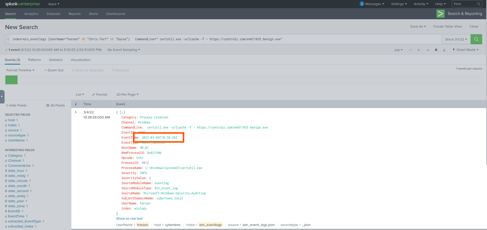

1 . How many logs are ingested from the month of March, 2022?
  - Filtered the search by date
  - 
2 . Imposter Alert: There seems to be an imposter account observed in the logs, what is the name of that user?
  - Listed all the users and noticed a very odd username
  - 
3 . Which user from the HR department was observed to be running scheduled tasks?
  - Filtered search by users and schedule command line to find the answer
  - 
4 . Which user from the HR department executed a system process (LOLBIN) to download a payload from a file-sharing host.
  - Filtered users by commandline and saw certutil.exe downloaded by user Haroon
  - 
  - 
5 . To bypass the security controls, which system process (lolbin) was used to download a payload from the internet?
  - Found the answer on the same page
  - 
6 . What was the date that this binary was executed by the infected host? format (YYYY-MM-DD)
  - Found the answer on the same page
  - 
7 . Which third-party site was accessed to download the malicious payload?
  - Found the answer on the same page
  - 
8 . What is the name of the file that was saved on the host machine from the C2 server during the post-exploitation phase?
  - Found the answer on the same page
  - 
9 . The suspicious file downloaded from the C2 server contained malicious content with the pattern THM{..........}; what is that pattern?
  - After visiting the website sad the flag
  - 
10. What is the URL that the infected host connected to?
  - Coppied the link
  - 
