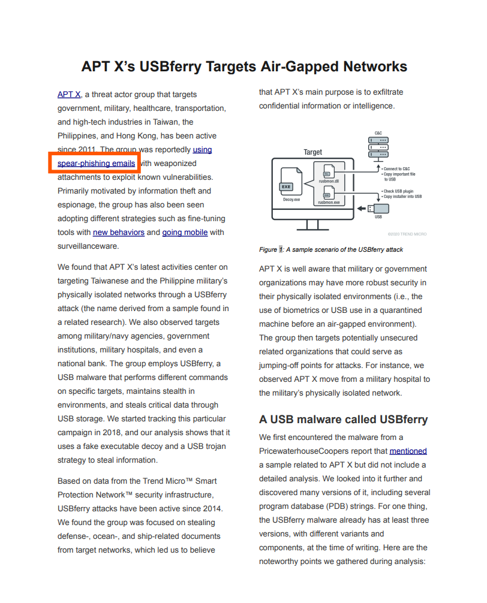
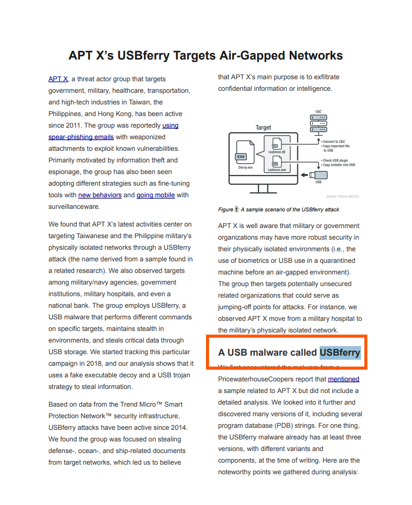
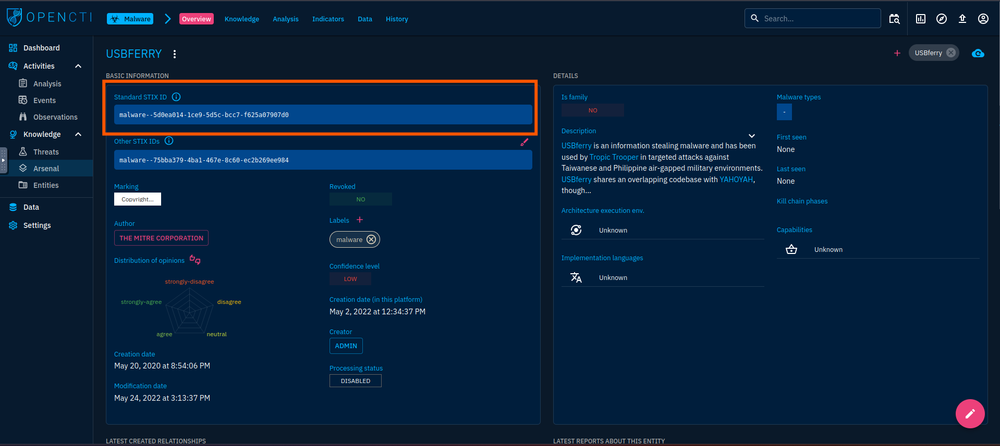
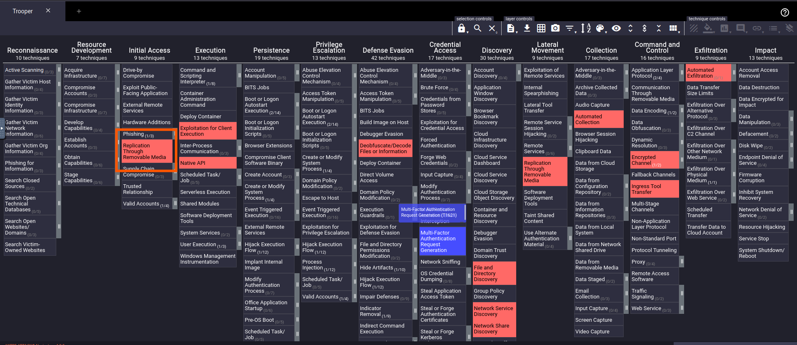
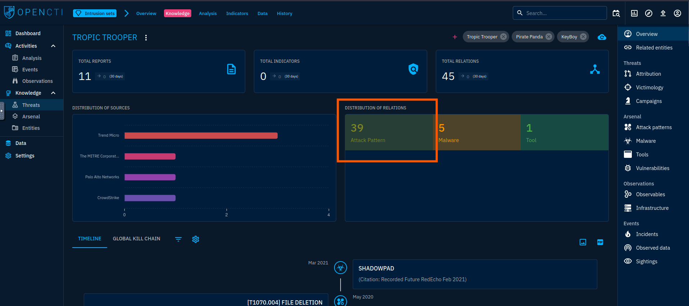
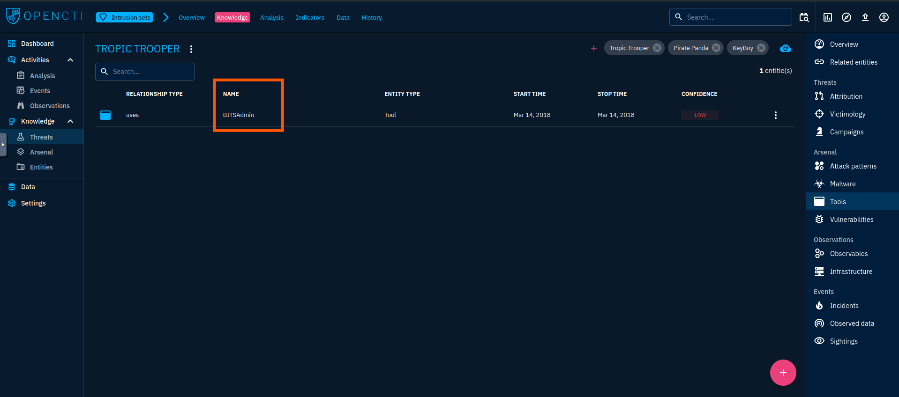
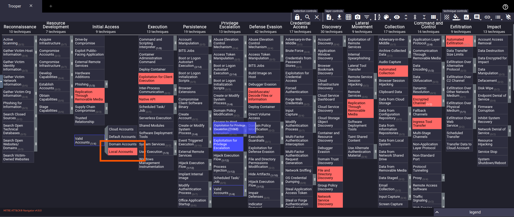
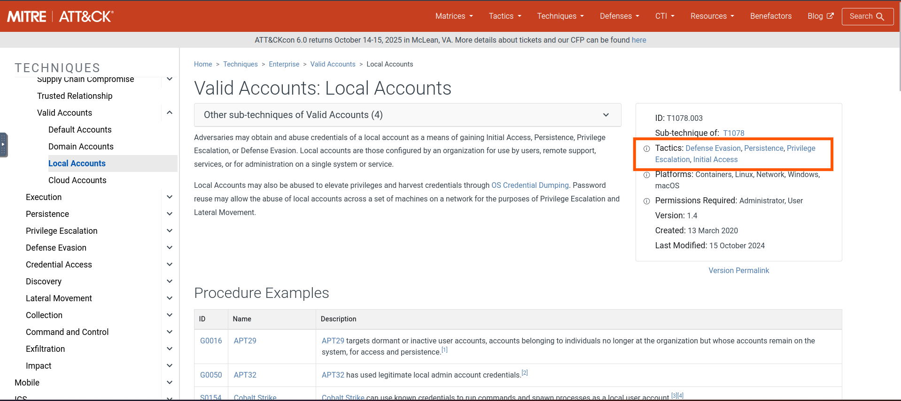
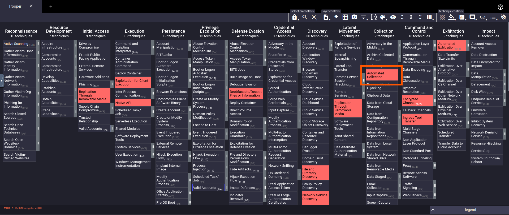

# 🛡️ Friday Overtime - Challange
---

## 🛠️ Tools Used
  - TryHackMe interactive lab environment
  - MITRE ATT&CK
  - Google
---
## 🔍 Scenario 1 Task 

A multinational technology company has been the target of several cyber attacks in the past few months. The attackers have been successful in stealing sensitive intellectual property and causing disruptions to the company's operations. A threat advisory report about similar attacks has been shared, and as a CTI analyst, your task is to identify the Tactics, Techniques, and Procedures (TTPs) being used by the Threat group and gather as much information as possible about their identity and motive. For this task, you will utilise the OpenCTI platform as well as the MITRE ATT&CK navigator, linked to the details below. 

- What kind of phishing campaign does APT X use as part of their TTPs?
- 
- What is the name of the malware used by APT X?
- 
- What is the malware's STIX ID?
- 
- With the use of a USB, what technique did APT X use for initial access?
- 
- On OpenCTI, how many Attack Pattern techniques are associated with the APT?
- 
- What is the name of the tool linked to the APT?
- 
- Load up the Navigator. What is the sub-technique used by the APT under Valid Accounts?
- 
- Under what Tactics does the technique above fall?
- 
- What technique is the group known for using under the tactic Collection?
- 

---
## ✅ Status: Completed

