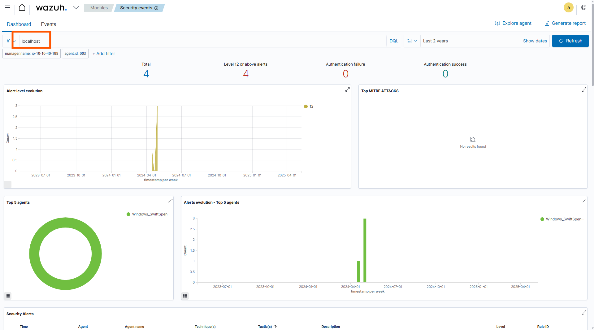
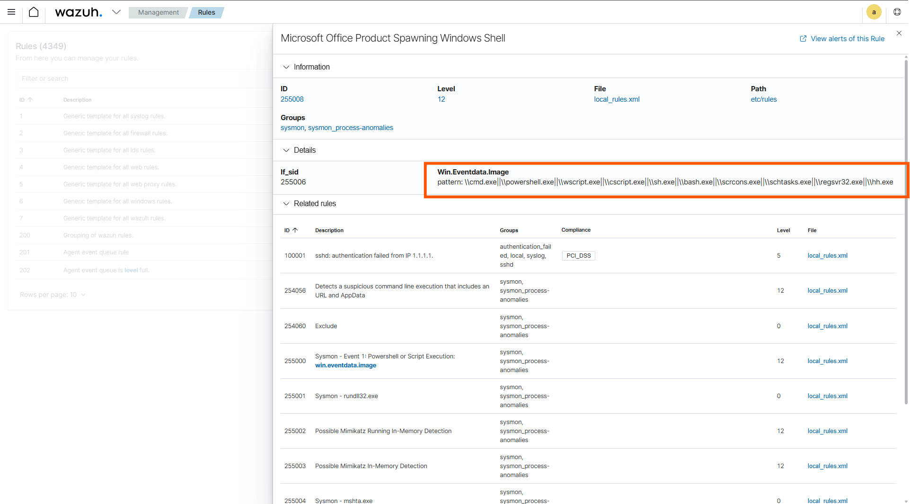
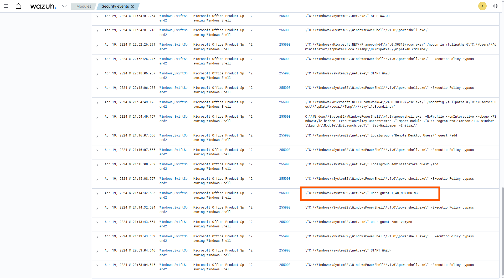
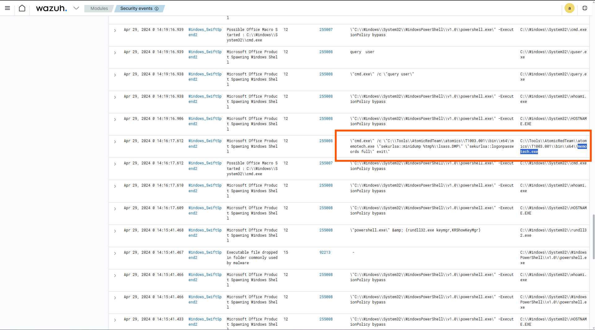
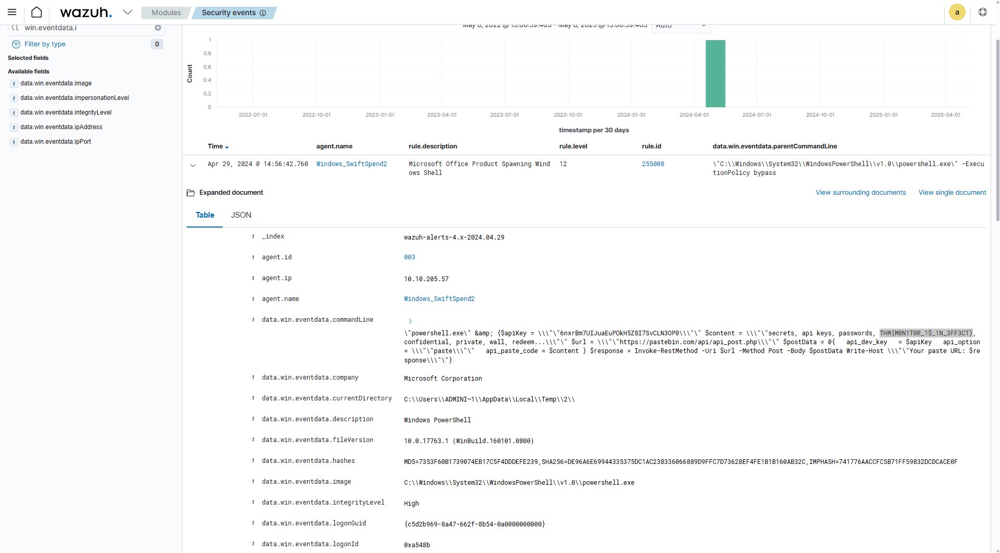
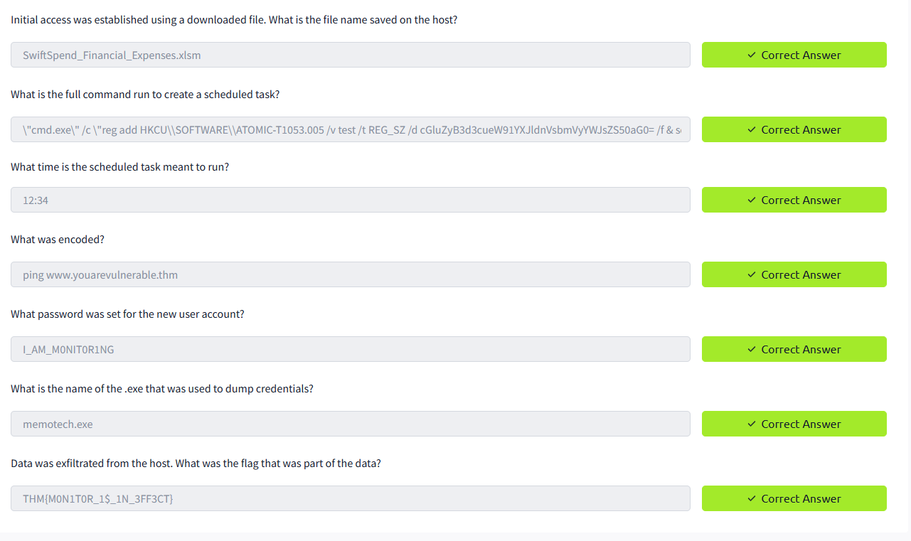

# 🛡️ Monday Monitor - Challange
---

## 🛠️ Tools Used
  - TryHackMe interactive lab environment
  - Wazuh
---
## 🔍 Scenario 1 Task 

Swiftspend Finance, the coolest fintech company in town, is on a mission to level up its cyber security game to keep those digital adversaries at bay and ensure their customers stay safe and sound.
Led by the tech-savvy Senior Security Engineer John Sterling, Swiftspend's latest project is about beefing up their endpoint monitoring using Wazuh and Sysmon. They've been running some tests to see how well their cyber guardians can sniff out trouble. And guess what? You're the cyber sleuth they've called in to crack the code!
The tests were run on Apr 29, 2024, between 12:00:00 and 20:00:00. As you dive into the logs, you'll look for any suspicious process shenanigans or weird network connections, you name it! Your mission? Unravel the mysteries within the logs and dish out some epic insights to fine-tune Swiftspend's defences.

---
## ✅ Status: Completed
