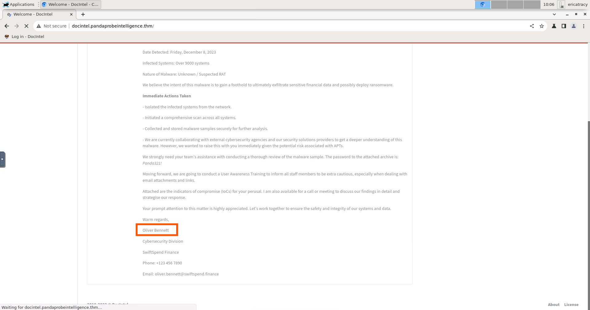
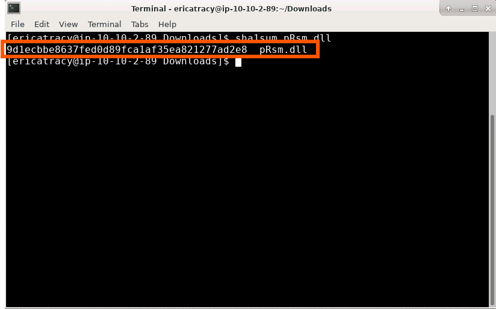

# 🛡️ Friday Overtime - Challange
---

## 🛠️ Tools Used
  - TryHackMe interactive lab environment
  - MITRE ATT&CK
  - Google
---
## 🔍 Scenario 1 Task 

An alert triggered: "Anomalous DNS Activity".

The case was assigned to you. Inspect the PCAP and retrieve the artefacts to confirm this alert is a true positive. 

- Investigate the dns-tunneling.pcap file. Investigate the dns.log file. What is the number of DNS records linked to the IPv6 address?
- 
- Investigate the conn.log file. What is the longest connection duration?
- 
- Investigate the dns.log file. Filter all unique DNS queries. What is the number of unique domain queries?
- 
- There are a massive amount of DNS queries sent to the same domain. This is abnormal. Let's find out which hosts are involved in this activity. Investigate the conn.log file. What is the IP address of the source host?
- 

---
## ✅ Status: Completed

