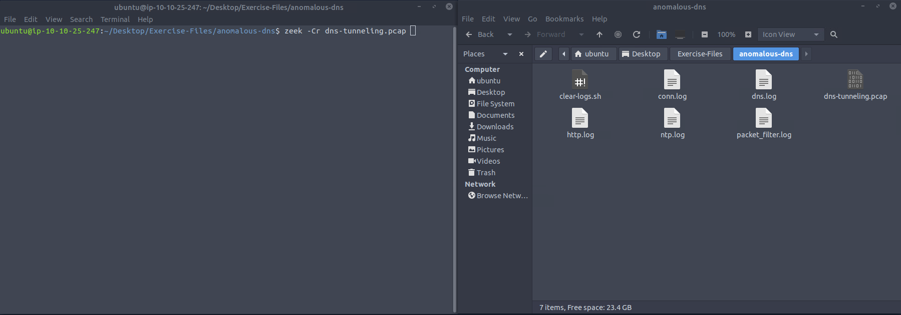
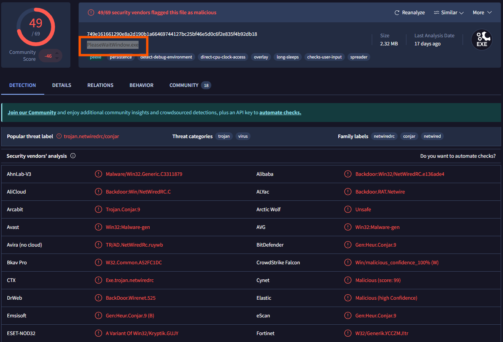

# 🛡️ Zeek - Challange
---

## 🛠️ Tools Used
  - TryHackMe interactive lab environment
  - Zeek
  - Google
---
## 🔍 Scenario 1 Task - Anomalous DNS

An alert triggered: "Anomalous DNS Activity".

The case was assigned to me. Inspect the PCAP and retrieve the artefacts to confirm this alert is a true positive. 

- Investigate the dns-tunneling.pcap file. Investigate the dns.log file. What is the number of DNS records linked to the IPv6 address?
- First I ran Zeek to generate log files agains dns-tunneling.pcap
- - 
- Second I used command `cat dns.log | zeek-cut qtype_name rcode | sort | uniq -c` to sort all uniq DNS and count them
- 
- Investigate the conn.log file. What is the longest connection duration?
- To find the connection duration I used command `cat conn.log | zeek-cut duration | sort -k1n` 
- 
- Investigate the dns.log file. Filter all unique DNS queries. What is the number of unique domain queries?
- There are lots of ".cisco-update.com" DNS queries, I need to filter the main address and find out the rest of the queries that don't contain the ".cisco-update.com" pattern using command `cat dns.log | zeek-cut query |rev | cut -d '.' -f 1-2 | rev | sort | uniq`
- 
- There are a massive amount of DNS queries sent to the same domain. This is abnormal. Let's find out which hosts are involved in this activity. Investigate the conn.log file. What is the IP address of the source host?
- Used zeek-cut and sort to find the answer `cat conn.log | zeek-cut id.orig_h orig_bytes | sort -k1n`
- 

## 🔍 Scenario 2 Task - Phishing Attempt
The case was assigned to me. Inspect the PCAP and retrieve the artefacts to confirm this alert is a true positive. 

- Investigate the logs. What is the suspicious source address? Enter your answer in defanged format.
- after going though all log files i finaly saw something suspiciouse in dhcp.log field called client_addr. after defanging it in cyberchef it cam out as a correct answer `cat dhcp.log | zeek-cut client_addr`
- 
- 
- 
- Investigate the http.log file. Which domain address were the malicious files downloaded from? Enter your answer in defanged format.
- After digging in the log file found a executable file that was downloaded from smart-fax.com `cat http.log | zeek-cut host resp_mime_types`
- 
- Investigate the malicious document in VirusTotal. What kind of file is associated with the malicious document?
- - 
- Investigate the extracted malicious .exe file. What is the given file name in Virustotal?
- used framework hash-demo against pcap file to get files hashes with command `zeek -Cr phishing.pcap hash-demo.zeek ` after copying hash went to VirusTotal and searched for hashes to get the file type
- 
- 
- 
- Investigate the malicious .exe file in VirusTotal. What is the contacted domain name? Enter your answer in defanged format.
- 
- Investigate the http.log file. What is the request name of the downloaded malicious .exe file?
- 
---
## ✅ Status: Completed

