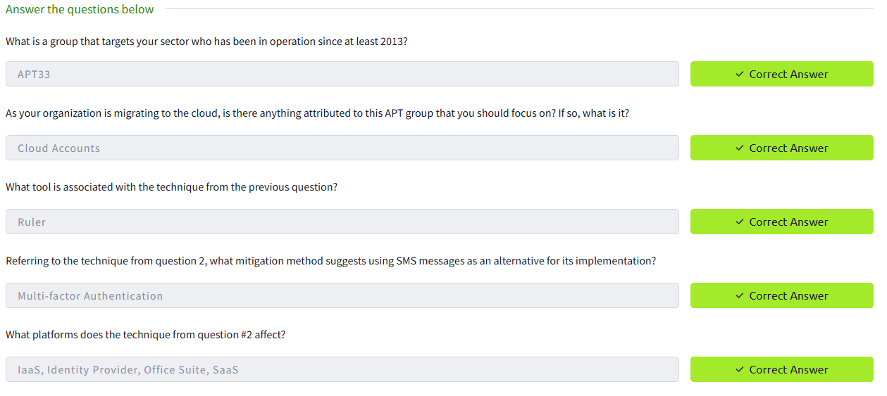

# 🪟Cyber Defence Frameworks - TryHackMe Room Writeup

## 🧠 What I Learned

Discover frameworks and policies that help establish a good security posture. Learn how organisations use these in defensive strategies.

---

## 📚 Topics Covered

- 🔺 Pyramid Of Pain:
  - Understanding the Pyramid of Pain concept as a Threat Hunter, Incident Responder, or SOC Analyst is important.

- 🔗 Cyber Kill Chain
  - learn about each phase of the Cyber Kill Chain Framework, the advantages and disadvantages of the traditional Cyber Kill Chain. 
 
- ⛓️ Unified Kill Chain
  - Understanding why frameworks such as the UKC are important and helpful in establishing a good cybersecurity posture
  - Using the UKC to understand an attacker's motivation, methodologies and tactics
  - Understanding the various phases of the UKC
  - Discover that the UKC is a framework that is used to complement other frameworks such as MITRE.

- 💠 Dimond Model
  - Identify the elements of an intrusion. 
  - Create a Diamond Model for events such as a breach, intrusion, attack, or incident. 
  - Analyze an Advanced Persistent Threat (APT). 

- Introduction to MITRE
  - Focus on other projects/research that the US-based non-profit MITRE Corporation has created for the cybersecurity community, specifically:
    - ATT&CK ®  ( A dversarial  T actics,  T echniques,  and   C ommon  K nowledge) Framework
    - CAR ( C yber  A nalytics  R epository) Knowledge Base
    - ENGAGE  (sorry, not a fancy acronym)
    - D3FEND ( D etection,  D enial, and  D isruption  F ramework  E mpowering  N etwork  D efense)
    - AEP ( A TT&CK  E mulation  P lans)
    
- Mapping logs to MITRE ATT&CK (Initial Access, Execution)
  -   

---

## 🛠️ Tools Used

- Windows Event Viewer
- TryHackMe interactive lab environment
- MITRE ATT&CK framework
- MITRE Cyber Analytics Repository
- MITRE ENGAGE Matrix
- MITRE D3FEND Matrix
- MITRE AEP Matrix

---

## 🔍 Scenario Task

You are a security analyst who works in the aviation sector. Your organization is moving their infrastructure to the cloud. Your goal is to use the ATT&CK® Matrix to gather threat intelligence on APT groups who might target this particular sector and use techniques targeting your areas of concern. You are checking to see if there are any gaps in coverage. After selecting a group, look over the selected group's information and their tactics, techniques, etc. 

---

## 📷 Screenshot

---

## 📌 Takeaways

- Windows logs are rich in forensic data if you know what to look for
- Event IDs help quickly categorize activity
- Triage begins with filtering the noise to find suspicious patterns
- Documenting timelines and behavior is key for escalation

---

## ✅ Status: Completed

🔗 [TryHackMe Room Link](https://tryhackme.com/room/windowseventlogs)  
🕒 Time Spent: ~1.5 hours

