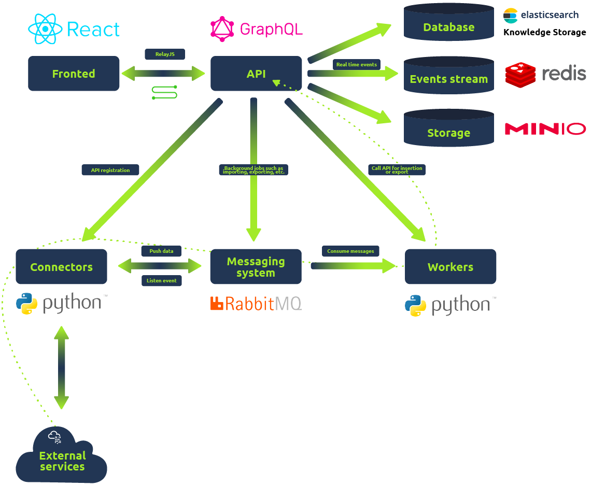
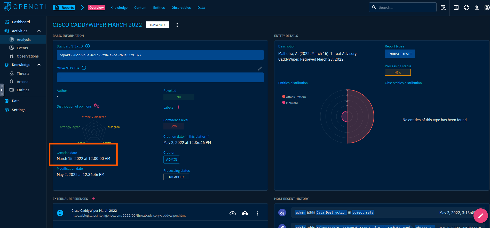
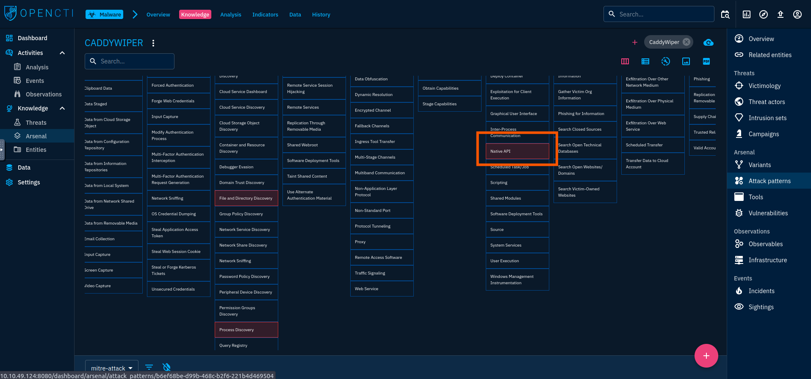
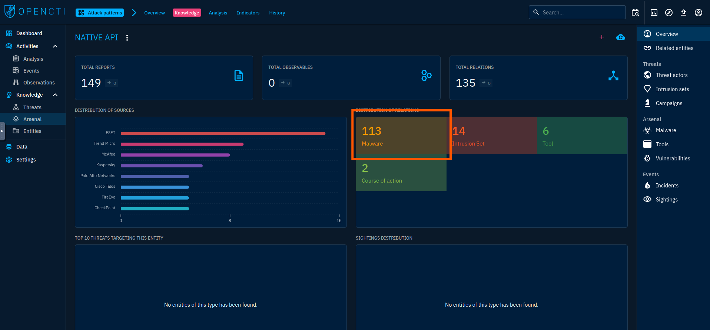
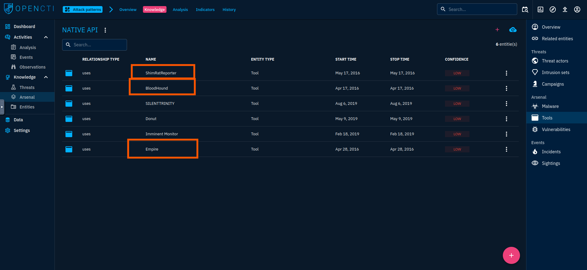
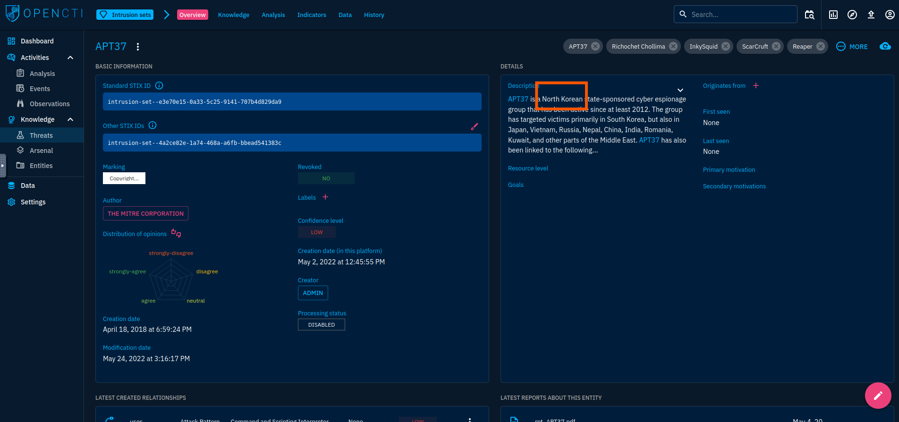
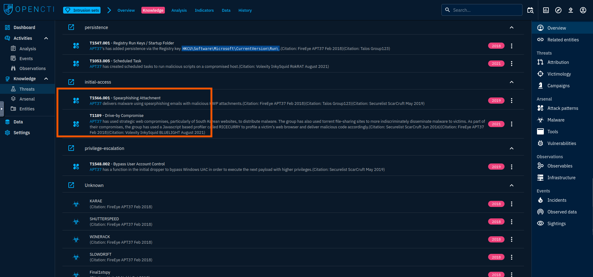

# 🪟 OpenCTI - TryHackMe Room Writeup

## 🧠 What I Learned

### **[OpenCTI](https://github.com/OpenCTI-Platform/opencti) is another open-sourced platform designed to provide organisations with the means to manage CTI through the storage, analysis, visualisation and presentation of threat campaigns, malware and IOCs.**
- What is OpenCTI and how is it used?
- How would I navigate through the platform?
- What functionalities will be important during a security threat analysis?

---

## 📚 Topics Covered

- ### OpenCTI Data Model:
  - OpenCTI uses a variety of knowledge schemas in structuring data, the main one being the Structured Threat Information Expression [(STIX2)](https://oasis-open.github.io/cti-documentation/stix/intro) standards
  - 
  
---

## 🛠️ Tools Used

- OpenCTI
- TryHackMe interactive lab environment
  
---

## 🔍 Investigative Scenario

As a SOC analyst, you have been tasked with investigations on malware and APT groups rampaging through the world. Your assignment is to look into the CaddyWiper malware and APT37 group. Gather information from OpenCTI to answer the following questions.
  - What is the earliest date recorded related to CaddyWiper?  Format: YYYY/MM/DD
  - 
  - Which Attack technique is used by the malware for execution?
  - 
  - How many malware relations are linked to this Attack technique?
  - 
  - Which 3 tools were used by the Attack Technique in 2016? (Ans: Tool1, Tool2, Tool3)
  - 
  - What country is APT37 associated with?
  - 
  - Which Attack techniques are used by the group for initial access? (Ans: Technique1, Technique2)
  - 

---

## ✅ Status: Completed

