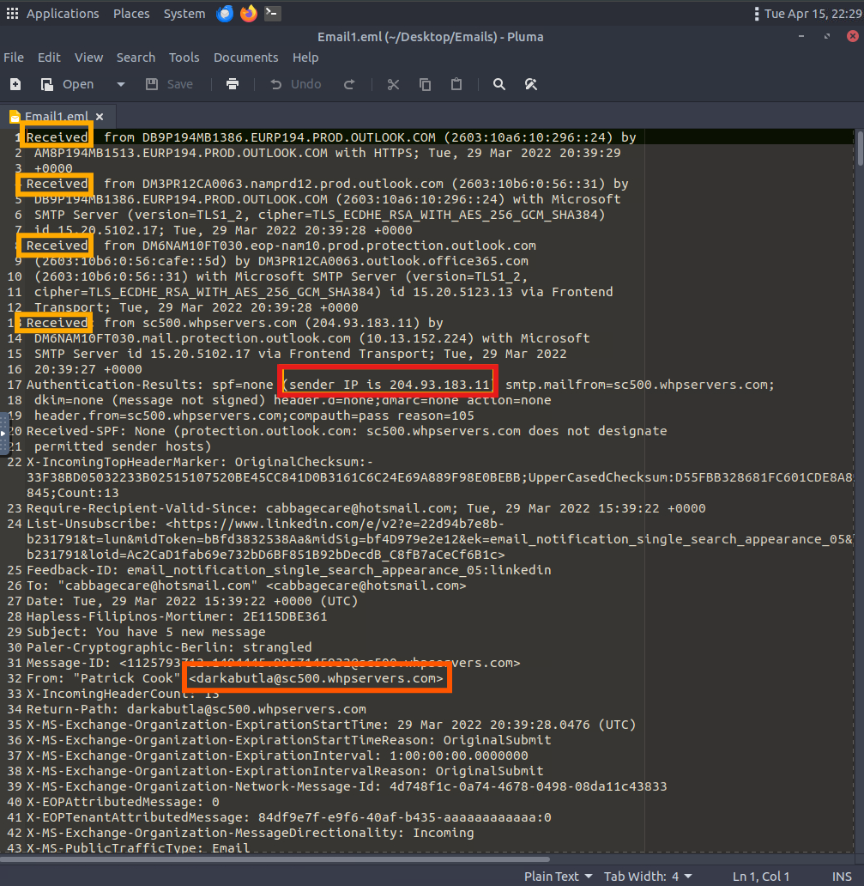
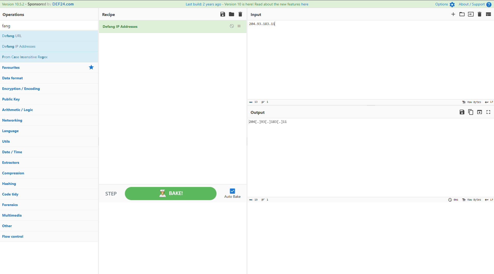
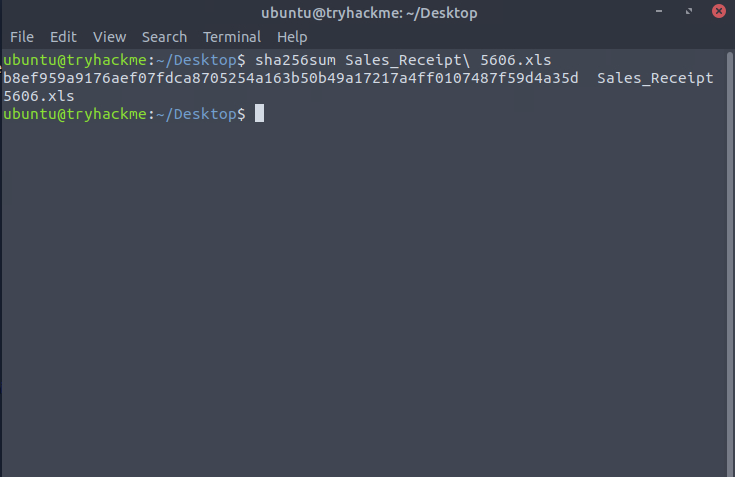
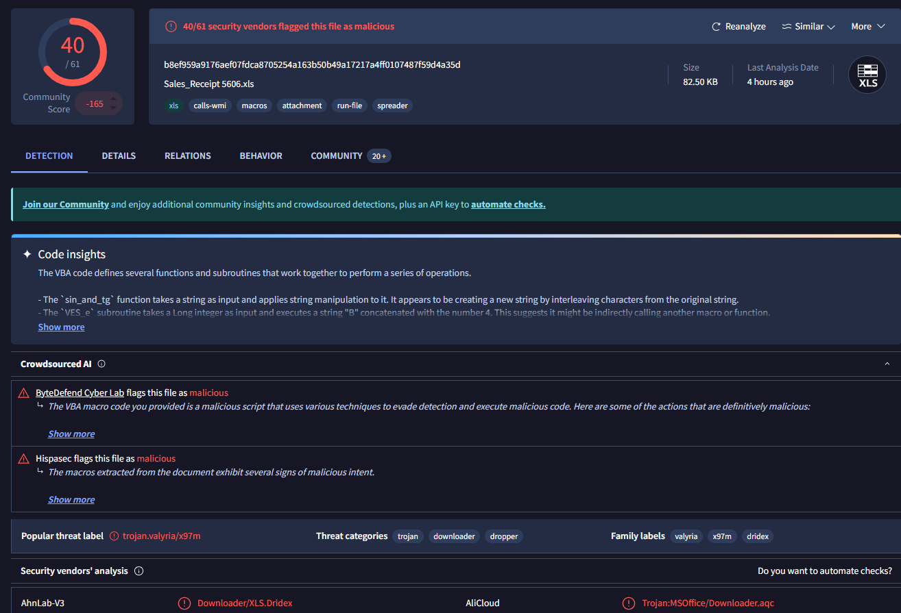
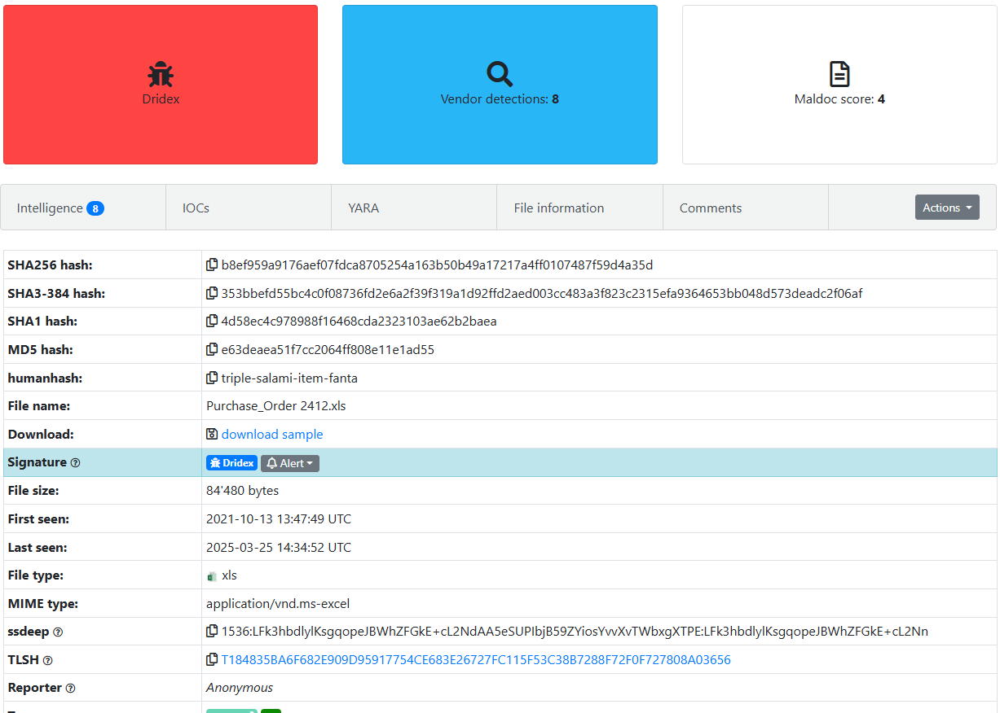

# 🪟Threat Intelligence Tools - TryHackMe Room Writeup

## 🧠 What I Learned

- Understanding the basics of threat intelligence & its classifications.
- Using UrlScan.io to scan for malicious URLs.
- Using Abuse.ch to track malware and botnet indicators.
- Investigate phishing emails using PhishTool
- Using Cisco's Talos Intelligence platform for intel gathering.
---

## 📚 Topics Covered

### 🔗 Urlscan.io 
  - a free service developed to assist in scanning and analysing websites. It is used to automate the process of browsing and crawling through websites to record activities and interactions.

### 🔗 Abuse.ch
  - A research project hosted by the Institue for Cybersecurity and Engineering at the Bern University of Applied Sciences in Switzerland. It was developed to identify and track malware and botnets through several operational platforms developed under the project. These platforms are: 
  - MalwareBazaar
  - FeodoTracker
  - SSL Blacklist
  - URLhaus
  - ThreatFox

### PhishTool
  - Email Phishing
  - PhishTool
    - Perform email analysis
    - Heuristic intelligence
    - Classification and reporting

  ### Cisco Talos Intelligence
  - https://talosintelligence.com/
---

## 🛠️ Tools Used

- [Cyberchef](https://cyberchef.org/)
- Pluma
- Thunderbird
---

## 🔍 Scenario 1 Task

You are a SOC Analyst and have been tasked to analyse a suspicious email, Email1.eml. To solve the task, open the email using Thunderbird on the attached VM, analyse it and answer the questions below.
- 
- 

## 🔍 Scenario 2 Task
Scenario: You are a SOC Analyst. Several suspicious emails have been forwarded to you from other coworkers. You must obtain details from each email to triage the incidents reported. 
- 
- 
- 

---

## ✅ Status: Completed

