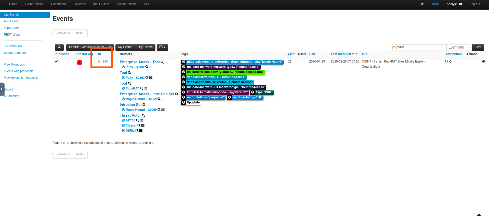
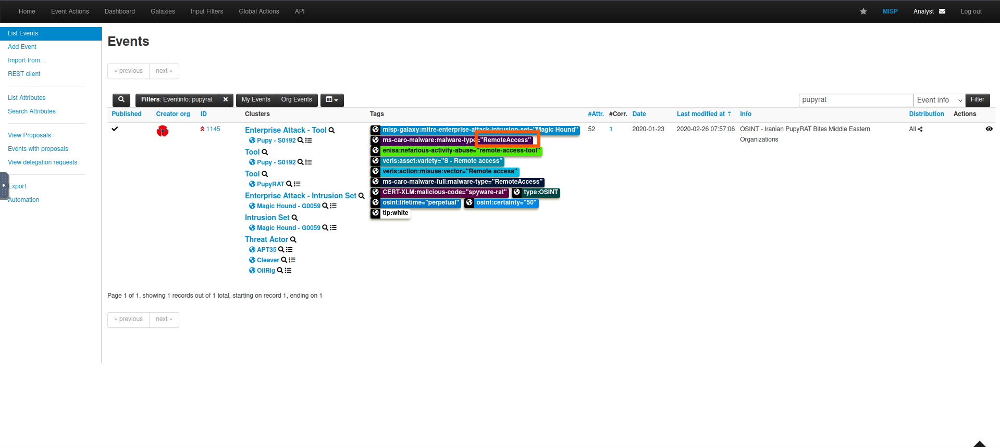
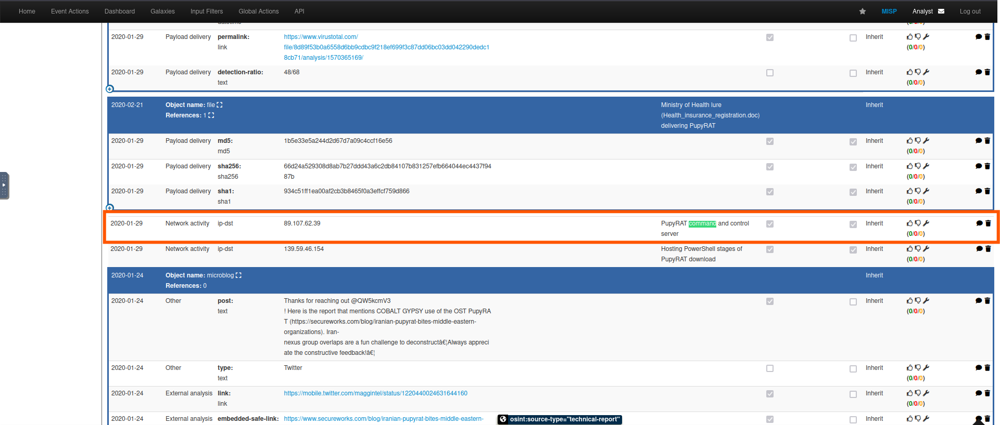

# 🪟 MISP - Malware Information Sharing Platform - TryHackMe Room Writeup

## 🧠 What I Learned

- Introduction to MISP and why it was developed.
- Use cases MISP can be applied to
- Core features and terminologies.
- Dashboard Navigation.
- Event Creation and Management.
- Feeds and Taxonomies.

---

## 📚 Topics Covered

- MISP Introduction: Features & Terminologies:
  - MISP (Malware Information Sharing Platform) is an open-source threat information platform that facilitates the collection, storage and distribution of threat intelligence and Indicators of Compromise (IOCs) related to malware, cyber attacks, financial fraud or any intelligence within a community of trusted members. 

- What does MISP support? 
  - IOC database: This allows for the storage of technical and non-technical information about malware samples, incidents, attackers and intelligence.
  - Automatic Correlation: Identification of relationships between attributes and indicators from malware, attack campaigns or analysis.
  - Data Sharing: This allows for sharing of information using different models of distributions and among different MISP instances.
  - Import & Export Features: This allows the import and export of events in different formats to integrate other systems such as NIDS, HIDS, and OpenIOC.
  - Event Graph: Showcases the relationships between objects and attributes identified from events.
  - API support: Supports integration with own systems to fetch and export events and intelligence.
 
- Using the System
  - Understanding why frameworks such as the UKC are important and helpful in establishing a good cybersecurity posture
  - Using the UKC to understand an attacker's motivation, methodologies and tactics
  - Understanding the various phases of the UKC
  - Discover that the UKC is a framework that is used to complement other frameworks such as MITRE.

- Feeds & Taxonomies
  - Feeds are resources that contain indicators that can be imported into MISP and provide attributed information about security events. These feeds provide analysts and organisations with continuously updated information on threats and adversaries and aid in their proactive defence against attacks.

## 🛠️ Tools Used

- MISP
- TryHackMe interactive lab environment

---

## 🔍 Scenario Task

CIRCL (Computer Incident Respons Center Luxembourg) published an event associated with PupyRAT infection. Your organisation is on alert for remote access trojans and malware in the wild, and you have been tasked to investigate this event and correlate the details with your SIEM. Use what you have learned from the room to identify the event and complete this task.
  - What event ID has been assigned to the PupyRAT event?
  - 
  - The event is associated with the adversary gaining ______ into organisations.
  - 
  - What IP address has been mapped as the PupyRAT C2 Server#
  - 
  
---

## ✅ Status: Completed

