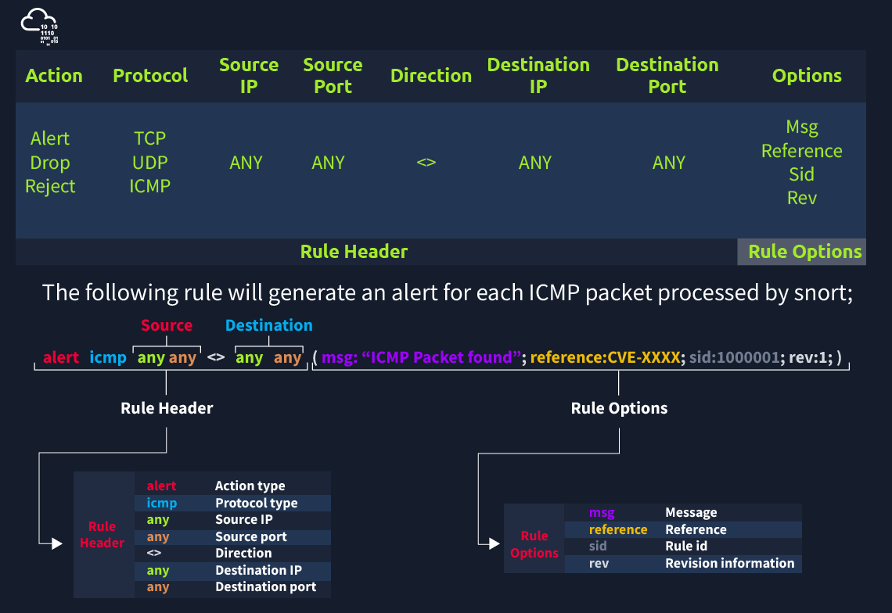

# Zeek - TryHackMe Room Writeup

## 🧠 What I Learned

"Zeek (formerly Bro) is the world's leading platform for network security monitoring. Flexible, open-source, and powered by defenders." "Zeek is a passive, open-source network traffic analyser. Many operators use Zeek as a network security monitor (NSM) to support suspicious or malicious activity investigations. Zeek also supports a wide range of traffic analysis tasks beyond the security domain, including performance measurement and troubleshooting."

---

## 📚 Topics Covered

- ### Zeek Architecture:
  - Zeek has two primary layers; "Event Engine" and "Policy Script Interpreter". The Event Engine layer is where the packets are processed; it is called the event core and is responsible for describing the event without focusing on event details. It is where the packages are divided into parts such as source and destination addresses, protocol identification, session analysis and file extraction.
  - The Policy Script Interpreter layer is where the semantic analysis is conducted. It is responsible for describing the event correlations by using Zeek scripts.

- ### Zeek Frameworks:

  - Zeek has several frameworks to provide extended functionality in the scripting layer. These frameworks enhance Zeek's flexibility and compatibility with other network components. Each framework focuses on the specific use case and easily runs with Zeek installation.
  - For instance, we will be using the "Logging Framework" for all cases. Having ide on each framework's functionality can help users quickly identify an event of interest.
  - 
- ### Zeek Outputs:
  
  - As mentioned before, Zeek provides 50+ log files under seven different categories, which are helpful in various areas such as traffic monitoring, intrusion detection, threat hunting and web analytics
  - Once you run Zeek, it will automatically start investigating the traffic or the given pcap file and generate logs automatically. Once you process a pcap with Zeek, it will create the logs in the working directory.
  - If you run the Zeek as a service, your logs will be located in the default log path. The default log path is: /opt/zeek/logs/
  - 
  ### Working with Zeek:

  -Here we can manage the Zeek service and view the status of the service. Primary management of the Zeek service is done with three commands; "status", "start", and "stop".
  -
  - zeekctl status
  - zeekctl start 
  - zeekctl stop

    Parameters and Description
  - -r	 Reading option, read/process a pcap file.
  - -C	 Ignoring checksum errors.
  - -v	 Version information.
  - zeekctl	ZeekControl module.
    
- ## Zeek Logs:

  - Network - Network protocol logs. *conn.log, dce_rpc.log, dhcp.log, dnp3.log, dns.log, ftp.log, http.log, irc.log,
                        kerberos.log, modbus.log, modbus_register_change.log, mysql.log, ntlm.log, ntp.log,
                        radius.log, rdp.log, rfb.log, sip.log, smb_cmd.log, smb_files.log, smb_mapping.log,
                        smtp.log, snmp.log, socks.log, ssh.log, ssl.log, syslog.log, tunnel.log.*
  - Files File - analysis result logs. *files.log, ocsp.log, pe.log, x509.log.*
  - NetControl - Network control and flow logs. *netcontrol.log, netcontrol_drop.log, netcontrol_shunt.log, netcontrol_catch_release.log, openflow.log.*
  - Detection - Detection and possible indicator logs. *intel.log, notice.log, notice_alarm.log, signatures.log, traceroute.log.*
  - Network Observations - Network flow logs. *known_certs.log, known_hosts.log, known_modbus.log, known_services.log, software.log.*
  - Miscellaneous - Additional logs cover external alerts, inputs and failures. *barnyard2.log, dpd.log, unified2.log, unknown_protocols.log, weird.log, weird_stats.log.*
  - Zeek Diagnostic - Zeek diagnostic logs cover system messages, actions and some statistics. *broker.log, capture_loss.log, cluster.log, config.log, loaded_scripts.log, packet_filter.log, print.log, prof.log, reporter.log, stats.log, stderr.log, stdout.log.*

[Zeek's official documentation](https://docs.zeek.org/en/current/script-reference/log-files.html)
[https://corelight.com/products/zeek-data/](https://corelight.com/products/zeek-data/)

Zeek-cut	Cut specific columns from zeek logs.

- ## CLI Kung-Fu Recall: Processing Zeek Logs
  - `cheetsheets/Linux-Basic-Command-Lines.md`
- ## investigate PCAPs with Snort
  - Capabilities of Snort are not limited to sniffing, logging and detecting/preventing the threats. PCAP read/investigate mode helps you work with pcap files. Once you have a pcap file and process it with Snort, you will receive default traffic statistics with alerts depending on your ruleset.
    - *-r / --pcap-single=	Read a single pcap*
    - *--pcap-list=""	Read pcaps provided in command (space separated).*
    - *--pcap-show	Show pcap name on console during processing.*
- ## Snort Rules!
  - Understanding the Snort rule format is essential for any blue and purple teamer.  The primary structure of the snort rule is shown below;
  - 
  - IP Filtering	`alert icmp 192.168.1.56 any <> any any  (msg: "ICMP Packet From "; sid: 100001; rev:1;)`
  - Filter an IP range	`alert icmp 192.168.1.0/24 any <> any any  (msg: "ICMP Packet Found"; sid: 100001; rev:1;)`
  - Filter multiple IP ranges	`alert icmp [192.168.1.0/24, 10.1.1.0/24] any <> any any  (msg: "ICMP Packet Found"; sid: 100001; rev:1;)`
  - Exclude IP addresses/ranges  `alert icmp !192.168.1.0/24 any <> any any  (msg: "ICMP Packet Found"; sid: 100001; rev:1;)`
  - Port Filtering  `alert tcp any any <> any 21  (msg: "FTP Port 21 Command Activity Detected"; sid: 100001; rev:1;)`
  - Exclude a specific port  `alert tcp any any <> any !21  (msg: "Traffic Activity Without FTP Port 21 Command Channel"; sid: 100001; rev:1;)`
  - Filter a port range (Type 1)  `alert tcp any any <> any 1:1024   (msg: "TCP 1-1024 System Port Activity"; sid: 100001; rev:1;)`
  - Filter a port range (Type 2)  `alert tcp any any <> any :1024   (msg: "TCP 0-1024 System Port Activity"; sid: 100001; rev:1;)`
  - Filter a port range (Type 3)  `alert tcp any any <> any 1025: (msg: "TCP Non-System Port Activity"; sid: 100001; rev:1;)`
  - Filter a port range (Type 4)  `alert tcp any any <> any [21,23] (msg: "FTP and Telnet Port 21-23 Activity Detected"; sid: 100001; rev:1;)`
  - ID	Filtering the IP id field.  `alert tcp any any <> any any (msg: "ID TEST"; id:123456; sid: 100001; rev:1;)`
  - Flags	
      Filtering the TCP flags.

        F - FIN
        S - SYN
        R - RST
        P - PSH
        A - ACK
        U - URG
- ## Editing Rules
    - sudo gedit /etc/snort/snort.conf
    - sudo gedit /etc/snort/rules/local.rules
- ## Running snort pcap file with local rules
    - snort -c local.rules -A full -l . -r TEST.pcap
- - ## Reading snort
    - sudo snort -r Snort_LOG.pcap
---

## 🛠️ Tools Used

- Linux
- TryHackMe interactive lab environment
- Snort

---

## ✅ Status: Completed
