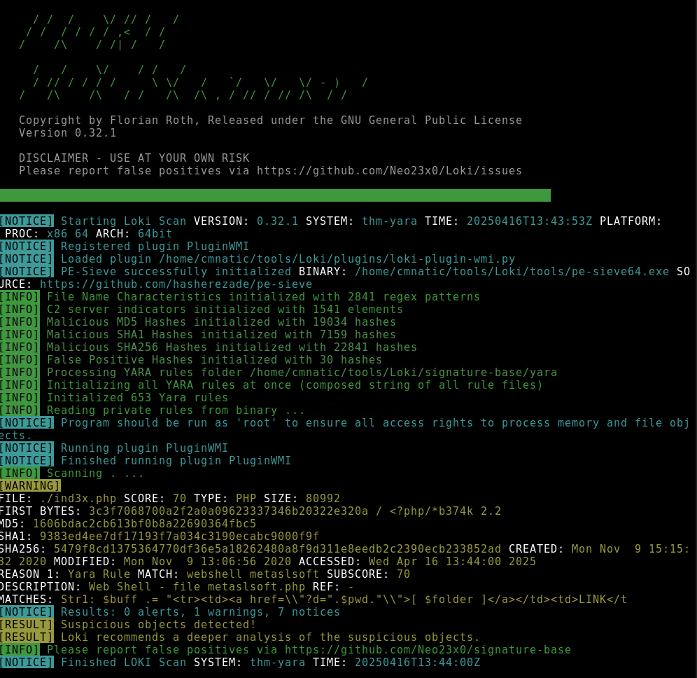
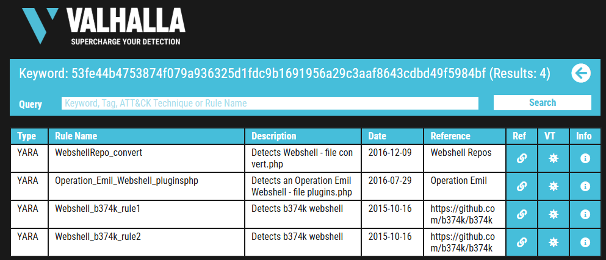

# 🪟 Yara - TryHackMe Room Writeup

## 🧠 What I Learned

Discover frameworks and policies that help establish a good security posture. Learn how organisations use these in defensive strategies.

---

## 📚 Topics Covered

- 🔺 Yara Rules:
  - Every rule must have a name and condition. For example, if we wanted to use "myrule.yar" on directory "some directory", we would use the following command:
yara myrule.yar somedirectory
-

-  ### LOKI 
  - A free open-source IOC (Indicator of Compromise) scanner created/written by Florian Roth.
- ### THOR
  - THOR Lite is Florian's newest multi-platform IOC AND YARA scanner   
-  ### FENRIR
  - This is the 3rd tool created by Neo23x0 (Florian Roth)
- ### YAYA
  - YAYA is a new open-source tool to help researchers manage multiple YARA rule repositories
- ### Using LOKI and its Yara rule set
  - EXAMPLE: cmnatic@thm-yara:~/suspicious-files/file1$ python ../../tools/Loki/loki.py -p .
  -  
- ### Creating Yara rules with yarGen
  - EXAMPLE: python3 yarGen.py -m /home/cmnatic/suspicious-files/file2 --excludegood -o /home/cmnatic/suspicious-files/file2.yar 
      explanation of the parameters above:
      - -m is the path to the files you want to generate rules for
      - --excludegood force to exclude all goodware strings (these are strings found in legitimate software and can increase false positives)
      - -o location & name you want to output the Yara rule 

- ### Valhalla
  - Valhalla is an online Yara feed created and hosted by [Nextron-Systems](https://www.nextron-systems.com/valhalla/) (erm, Florian Roth)
  - 
    
---

## 🛠️ Tools Used

- Windows Event Viewer
- TryHackMe interactive lab environment
- MITRE ATT&CK framework
- MITRE Cyber Analytics Repository
- MITRE ENGAGE Matrix
- MITRE D3FEND Matrix
- MITRE AEP Matrix

---

## 🔍 Scenario 1 Task

You are a security analyst who works in the aviation sector. Your organization is moving their infrastructure to the cloud. Your goal is to use the ATT&CK® Matrix to gather threat intelligence on APT groups who might target this particular sector and use techniques targeting your areas of concern. You are checking to see if there are any gaps in coverage. After selecting a group, look over the selected group's information and their tactics, techniques, etc.

---

## ✅ Status: Completed

🔗 [TryHackMe Room Link]((https://tryhackme.com/room/mitre))  
🕒 Time Spent: ~3 hours

# 🏛️ Pyramid Challenge - TryHackMe

## 🧩 Challenge Type
This was an investigative-style challenge that tested my ability to **dig into provided data** to find clues, decode information, and piece together a series of answers — similar to a **CTF-style triage puzzle**.

It required:
- Careful attention to detail
- Pattern recognition
- Logical thinking and patience

---

## 🔍 What I Did

- Explored the file closely for **hidden information**
- Used **online tools and manual inspection** to find embedded clues (metadata, steganography, filenames)
- Followed a trail of subtle hints and decoded messages to uncover the correct answers
- Each correct answer led to the next layer of the investigation

---

## 🧠 What I Learned

- How to approach investigative challenges methodically
- How small clues (like filenames or metadata) can be critical in investigations
- Importance of documenting each step and hypothesis
- How real-world triage can involve creative problem-solving, not just tool usage

---

## 💡 Skills Demonstrated

- Analytical thinking
- Attention to detail
- Basic steganography and OSINT-style investigation
- Persistence in multi-layered challenges

---

## 📌 Takeaways

This challenge was a great reminder that not all investigations are technical — some rely on mindset. It strengthened my **SOC investigation workflow**, including documentation, checking assumptions, and breaking down abstract problems.

---

✅ Status: Completed  
🕒 Time spent: ~1 hour  
