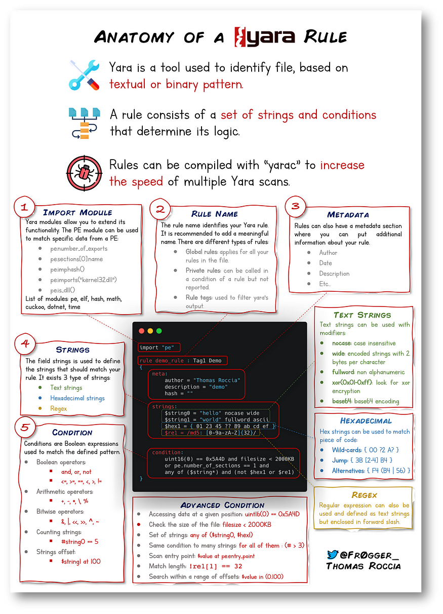

# 🪟 Yara - TryHackMe Room Writeup

## 🧠 What I Learned

"The pattern matching swiss knife for malware researchers (and everyone else)" (Virustotal., 2020)

---

## 📚 Topics Covered

- ### Yara Rules:
  - Every rule must have a name and condition. For example, if we wanted to use "myrule.yar" on directory "some directory", we would use the following command:
yara myrule.yar somedirectory
-

-  ### LOKI 
  - A free open-source IOC (Indicator of Compromise) scanner created/written by Florian Roth.
- ### THOR
  - THOR Lite is Florian's newest multi-platform IOC AND YARA scanner   
-  ### FENRIR
  - This is the 3rd tool created by Neo23x0 (Florian Roth)
- ### YAYA
  - YAYA is a new open-source tool to help researchers manage multiple YARA rule repositories
- ### Using LOKI and its Yara rule set
  - EXAMPLE: cmnatic@thm-yara:~/suspicious-files/file1$ python ../../tools/Loki/loki.py -p .
  -  
- ### Creating Yara rules with yarGen
  - EXAMPLE: python3 yarGen.py -m /home/cmnatic/suspicious-files/file2 --excludegood -o /home/cmnatic/suspicious-files/file2.yar 
      explanation of the parameters above:
      - -m is the path to the files you want to generate rules for
      - --excludegood force to exclude all goodware strings (these are strings found in legitimate software and can increase false positives)
      - -o location & name you want to output the Yara rule 

- ### Valhalla
  - Valhalla is an online Yara feed created and hosted by [Nextron-Systems](https://www.nextron-systems.com/valhalla/) (erm, Florian Roth)
  - 
    
---

## 🛠️ Tools Used

- Yara
- Loki
- VirusTotal
- Valhalla

---

## ✅ Status: Completed
